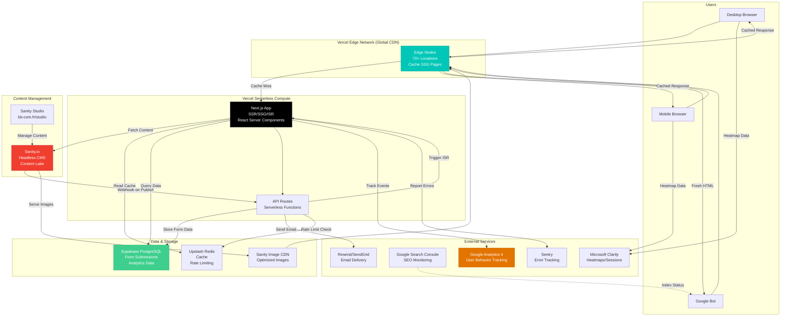
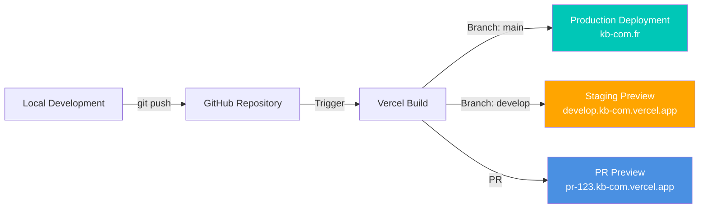

# KB-COM - Fullstack Architecture Document

<!-- Powered by BMAD™ Core -->

**Project:** KB-COM Website Redesign with SEO Excellence
**Version:** 1.0
**Date:** 2026-01-06
**Status:** Draft
**Architect:** Winston (BMAD Architect Agent)

---

## Introduction

This document outlines the complete fullstack architecture for KB-COM's website redesign project, including frontend systems, backend services, CMS integration, and deployment infrastructure. It serves as the single source of truth for development, ensuring consistency across the entire technology stack and alignment with the SEO-excellence goals defined in the PRD.

This unified architecture combines frontend and backend concerns into a cohesive system optimized for:
- **SEO Performance**: Server-side rendering, perfect Core Web Vitals, optimal indexing
- **Developer Experience**: Type-safe development, modern tooling, fast feedback loops
- **Scalability**: Edge computing, serverless architecture, global CDN
- **Content Management**: Headless CMS enabling non-technical content updates
- **Analytics & Monitoring**: Comprehensive tracking and performance monitoring

### Starter Template or Existing Project

**Status:** Greenfield project (new build from scratch)

**Approach:** While this is a greenfield project, we will leverage Next.js 15's App Router as the foundational framework, which provides best-in-class SEO capabilities out of the box. No third-party starter template will be used to avoid unnecessary dependencies and maintain full architectural control.

**Rationale:**
- Next.js App Router provides opinionated structure while remaining flexible
- Vercel's documentation and examples serve as reference implementations
- Clean start ensures no legacy constraints or unwanted dependencies
- Full control over every architectural decision

### Change Log

| Date       | Version | Description                        | Author            |
|------------|---------|-------------------------------------|-------------------|
| 2026-01-06 | 1.0     | Initial architecture document      | BMAD Architect    |

---

## High Level Architecture

### Technical Summary

KB-COM's website architecture follows a **modern Jamstack + Serverless** approach, leveraging Next.js 15's App Router for a hybrid rendering strategy (SSG, SSR, ISR) deployed on Vercel's global edge network. The frontend is built with React 19 and TypeScript 5 for type-safe, performant UI development, styled with Tailwind CSS for rapid, maintainable styling. Content is managed through Sanity.io's headless CMS, providing real-time collaborative editing while keeping content decoupled from presentation. Backend services are implemented as Next.js API Routes (serverless functions) for form handling, integrations, and data processing. The entire system is optimized for SEO excellence, achieving Lighthouse 100/100 scores through Server Components, edge caching, optimized assets, and perfect structured data implementation. This architecture enables KB-COM to rank competitively on Google while providing an exceptional user experience and efficient content management workflow.

### Platform and Infrastructure Choice

#### Platform Selection Analysis

After evaluating multiple cloud platforms against the PRD requirements, the recommendation is:

**Recommended Platform: Vercel (Primary) + Sanity.io (CMS) + Supabase (Database)**

**Comparison Matrix:**

| Platform Option | Pros | Cons | Score (1-10) |
|----------------|------|------|--------------|
| **Vercel + Sanity + Supabase** | - Optimal Next.js integration<br>- Global edge network (70+ locations)<br>- Automatic deployments & previews<br>- Built-in Core Web Vitals analytics<br>- Generous free tier<br>- Sanity excellent CMS DX | - Vendor lock-in (moderate)<br>- Costs scale with traffic<br>- Less control vs self-hosted | **9/10** ✅ |
| **AWS (S3 + CloudFront + Lambda)** | - Maximum control and flexibility<br>- Enterprise-grade scalability<br>- Wide service ecosystem | - Complex setup and maintenance<br>- Higher DevOps overhead<br>- Slower time-to-market<br>- Steeper learning curve | 7/10 |
| **Cloudflare Pages + Workers** | - Excellent performance<br>- Competitive pricing<br>- Strong CDN | - Less mature Next.js support<br>- Smaller ecosystem vs Vercel<br>- More manual configuration | 7.5/10 |
| **Netlify** | - Similar to Vercel<br>- Good DX | - Slightly behind Vercel for Next.js<br>- Less optimal SSR support | 7/10 |

**Final Decision: Vercel + Sanity.io + Supabase**

**Rationale:**
1. **Vercel** is purpose-built for Next.js (same company develops both), ensuring optimal performance, DX, and future compatibility
2. **Sanity.io** provides industry-leading headless CMS with real-time collaboration, flexible content modeling, and excellent developer experience
3. **Supabase** offers managed PostgreSQL with real-time capabilities, perfect for form submissions, analytics, and future features (user accounts, etc.)
4. This stack aligns perfectly with PRD's SEO and performance requirements (Lighthouse 100/100, Core Web Vitals)
5. Cost-effective for agency site traffic patterns (estimated €50-150/month total vs €300+/month for AWS equivalent)

**Platform Details:**

- **Platform:** Vercel
- **Key Services:**
  - **Vercel Edge Network**: Global CDN (70+ locations) with automatic edge caching
  - **Vercel Serverless Functions**: Next.js API Routes deployed as serverless functions
  - **Vercel Analytics**: Core Web Vitals monitoring, page performance tracking
  - **Vercel Image Optimization**: Automatic WebP/AVIF conversion, responsive images
  - **Sanity.io**: Headless CMS (Content Lake)
  - **Supabase**: Managed PostgreSQL, real-time database, Storage
  - **Upstash Redis**: Serverless Redis for caching, rate limiting
- **Deployment Host and Regions:**
  - Primary: Vercel Edge Network (global, 70+ locations)
  - Closest edge nodes to Tours, France: Paris (primary), Frankfurt, London
  - Sanity CDN: Global
  - Supabase: EU West (Ireland or Frankfurt - GDPR compliant)

**Cost Estimate (Monthly):**
- Vercel Pro: €20/month (required for teams, analytics, more bandwidth)
- Sanity: €0-99/month (free tier initially, Growth plan if >100k API requests)
- Supabase: €0-25/month (free tier covers MVP, Pro if scaling)
- Upstash Redis: €0-10/month (free tier likely sufficient)
- Domain: ~€1/month
- Email (Resend/SendGrid): €0-20/month
- **Total Estimated: €40-175/month** (vs €10-20/month for basic WordPress hosting, but vastly superior performance and capabilities)

### Repository Structure

**Structure:** Monorepo (Single Repository)

**Monorepo Tool:** None required initially (npm workspaces if needed in future)

**Rationale:**
- Single Next.js application simplifies development and deployment for MVP
- All frontend and API code in one repository maintains coherence
- Vercel automatically handles build and deployment from monorepo root
- Easier dependency management and code sharing
- Can migrate to Turborepo or Nx later if project grows to multiple apps

**Package Organization:**

```
kb-com-v3/
├── .github/
│   └── workflows/
│       ├── ci.yml                  # Lint, type-check, test on PRs
│       └── lighthouse-ci.yml        # Lighthouse performance checks
├── app/                            # Next.js App Router
│   ├── (marketing)/                # Route group for marketing pages
│   │   ├── page.tsx                # Homepage (/)
│   │   ├── services/
│   │   │   ├── page.tsx            # Services listing
│   │   │   ├── creation-site-internet/
│   │   │   ├── e-commerce/
│   │   │   ├── seo-referencement/
│   │   │   └── applications-web-sur-mesure/
│   │   ├── portfolio/
│   │   │   ├── page.tsx            # Portfolio listing
│   │   │   └── [slug]/page.tsx     # Individual case studies
│   │   ├── about/page.tsx
│   │   ├── contact/page.tsx
│   │   └── blog/
│   │       ├── page.tsx            # Blog listing
│   │       ├── [slug]/page.tsx     # Blog post detail
│   │       └── category/[slug]/page.tsx
│   ├── agence-web-[location]/      # Dynamic geo landing pages
│   │   └── page.tsx                # Template for all geo pages
│   ├── api/                        # API Routes (serverless functions)
│   │   ├── contact/route.ts        # Contact form submission
│   │   ├── sanity-webhook/route.ts # ISR trigger from Sanity
│   │   └── analytics/route.ts      # Custom analytics endpoints
│   ├── layout.tsx                  # Root layout with header/footer
│   ├── not-found.tsx               # 404 page
│   ├── error.tsx                   # Error boundary
│   ├── sitemap.ts                  # Dynamic sitemap generation
│   ├── robots.ts                   # robots.txt
│   └── manifest.ts                 # PWA manifest
├── components/
│   ├── ui/                         # shadcn/ui components (Button, Form, etc.)
│   ├── sections/                   # Page sections (Hero, Services Grid, etc.)
│   ├── layout/                     # Layout components (Header, Footer, etc.)
│   └── forms/                      # Form components (ContactForm, etc.)
├── lib/
│   ├── sanity/
│   │   ├── client.ts               # Sanity client config
│   │   ├── queries.ts              # GROQ queries
│   │   └── image.ts                # Image URL helpers
│   ├── seo/
│   │   ├── metadata.ts             # Metadata generators
│   │   └── structured-data.ts      # Schema.org JSON-LD helpers
│   ├── analytics/
│   │   ├── gtag.ts                 # Google Analytics helpers
│   │   └── events.ts               # Custom event tracking
│   ├── db/                         # Database (Supabase) client
│   │   ├── client.ts
│   │   └── queries.ts
│   ├── email/                      # Email service (Resend)
│   │   └── send.ts
│   └── utils/                      # Utility functions
│       └── cn.ts                   # Tailwind class merger
├── public/
│   ├── images/                     # Static images
│   ├── fonts/                      # Self-hosted fonts (if needed)
│   └── favicon.ico
├── sanity/                         # Sanity Studio (optional embedded)
│   ├── schemas/                    # Content schemas
│   │   ├── project.ts
│   │   ├── blogPost.ts
│   │   ├── geoLocation.ts
│   │   └── index.ts
│   └── sanity.config.ts
├── tests/
│   ├── unit/                       # Vitest unit tests
│   ├── integration/                # Integration tests
│   └── e2e/                        # Playwright E2E tests
├── .env.local.example              # Environment variables template
├── .env.local                      # Local secrets (gitignored)
├── next.config.ts                  # Next.js configuration
├── tailwind.config.ts              # Tailwind CSS configuration
├── tsconfig.json                   # TypeScript configuration
├── package.json
├── package-lock.json
└── README.md
```

**Shared Code Strategy:**
- Type definitions in `/types` folder shared across frontend and API routes
- Utility functions in `/lib/utils` available everywhere
- Validation schemas (Zod) in `/lib/schemas` used by both frontend forms and API routes for type-safe validation

### High Level Architecture Diagram



**Architecture Flow Explanation:**

1. **User Request Flow:**
   - User (desktop/mobile) or search bot requests page
   - Request hits closest Vercel edge node (Paris/Frankfurt for EU users)
   - Edge checks cache: if SSG page cached, return immediately (sub-50ms response)
   - If cache miss or SSR page, request forwarded to Next.js compute

2. **Rendering Flow:**
   - Next.js App Router determines rendering strategy per route:
     - **SSG (Static Site Generation)**: Homepage, service pages, blog posts (pre-rendered at build)
     - **ISR (Incremental Static Regeneration)**: Portfolio, blog (revalidate every hour or on-demand via webhook)
     - **SSR (Server-Side Rendering)**: Dynamic geo pages, personalized content (rendered per request with edge caching)
   - React Server Components fetch data directly (no client-side waterfalls)
   - Rendered HTML sent to edge, then to user

3. **Content Management Flow:**
   - Content editor uses Sanity Studio (kb-com.fr/studio or studio.sanity.io)
   - On publish, Sanity sends webhook to API route (`/api/sanity-webhook`)
   - Webhook triggers ISR revalidation for affected pages
   - Next.js rebuilds static pages in background, updates edge cache

4. **Form Submission Flow:**
   - User submits contact form
   - Client-side validation (React Hook Form + Zod)
   - POST to `/api/contact` API route
   - Server-side validation, rate limit check (Redis)
   - Store submission in Supabase
   - Send email via Resend
   - Track conversion in GA4
   - Return success response

5. **SEO Optimization Flow:**
   - Google Bot requests page
   - Receives fully rendered HTML (SSR/SSG) with complete metadata
   - Structured data (JSON-LD) embedded in `<head>`
   - Images served via Sanity CDN with WebP/AVIF, proper alt text
   - Sitemap.xml auto-generated, submitted to Search Console
   - Core Web Vitals optimized (edge caching, optimized assets)

### Architectural Patterns

The following architectural patterns guide the design and implementation of KB-COM's website:

- **Jamstack Architecture:** Decoupled frontend (Next.js) and content backend (Sanity CMS) with serverless APIs for dynamic functionality - _Rationale:_ Optimal for SEO (static/pre-rendered HTML), security (no exposed backend), performance (edge caching), and scalability (serverless auto-scaling).

- **Serverless Architecture:** Backend logic implemented as stateless serverless functions (Next.js API Routes on Vercel) - _Rationale:_ Zero infrastructure management, automatic scaling, pay-per-use cost model, perfect for agency site traffic patterns (low baseline, occasional spikes).

- **Edge-First Rendering:** Leverage Vercel Edge Network for global low-latency content delivery with edge caching - _Rationale:_ Sub-100ms TTFB globally, critical for SEO (Core Web Vitals), excellent user experience regardless of geographic location.

- **Hybrid Rendering Strategy:** Mix of SSG (Static Site Generation), ISR (Incremental Static Regeneration), and SSR (Server-Side Rendering) per route - _Rationale:_ Optimize for each page type—static for performance (service pages), ISR for fresh content (blog), SSR for dynamic personalization (future features).

- **Headless CMS Pattern:** Content managed in Sanity.io, consumed via API, fully decoupled from presentation layer - _Rationale:_ Content flexibility (omnichannel ready), developer freedom (any frontend framework), editor empowerment (real-time collaborative editing), content reusability across pages.

- **React Server Components (RSC):** Leverage Next.js App Router's React Server Components for zero-JavaScript data fetching - _Rationale:_ Eliminates client-side data fetching waterfalls, reduces JavaScript bundle size, improves Core Web Vitals (FCP, LCP), better SEO (content rendered server-side).

- **API Gateway Pattern:** Centralized API routes layer handles authentication, rate limiting, validation, and business logic - _Rationale:_ Single point for cross-cutting concerns (auth, logging, rate limiting), consistent error handling, easier to secure and monitor.

- **Repository Pattern (Data Access):** Abstract database queries behind clean interfaces (`lib/db/queries.ts`) - _Rationale:_ Testability (mock data layer), flexibility (swap Supabase for another DB later), clean separation of concerns.

- **Atomic Design (Component Architecture):** UI components organized from atoms (Button) → molecules (FormField) → organisms (ContactForm) → templates → pages - _Rationale:_ Reusability, consistency, maintainability, faster development with shadcn/ui base components.

- **Mobile-First Responsive Design:** Design and develop for mobile viewport first, progressively enhance for larger screens - _Rationale:_ 60%+ of traffic is mobile (per Brief), Google mobile-first indexing, ensures core experience works on all devices.

- **Progressive Enhancement:** Core functionality works without JavaScript, enhanced experience with JavaScript enabled - _Rationale:_ Resilience, accessibility, works for users with JS disabled, SEO benefits (crawlers see full content even if JS fails).

- **Schema-Driven Development:** Use TypeScript + Zod schemas as single source of truth for data structures - _Rationale:_ Type safety across stack (frontend ↔ API ↔ database), runtime validation, reduced bugs, better DX with autocomplete.

- **BFF (Backend For Frontend):** API routes tailored specifically for Next.js frontend needs, not generic REST API - _Rationale:_ Optimal data shape for UI (reduce over/under-fetching), faster development (collocated with frontend), simpler architecture for this use case.

---

## Tech Stack

This is the **DEFINITIVE** technology selection for the KB-COM project. All development must use these exact technologies and versions. Any deviations must be approved by the project architect and documented with rationale.

### Technology Stack Table

| Category | Technology | Version | Purpose | Rationale |
|----------|-----------|---------|---------|-----------|
| **Frontend Language** | TypeScript | 5.x | Type-safe JavaScript development | Catches errors at compile time, better IDE support, self-documenting code, industry standard for React apps |
| **Frontend Framework** | Next.js (App Router) | 15.x | React meta-framework with SSR/SSG/ISR | Best-in-class SEO (server rendering), automatic code splitting, image optimization, Vercel-optimized, React Server Components |
| **UI Library** | React | 19.x | Component-based UI library | Industry standard, massive ecosystem, Server Components for zero-JS data fetching, excellent DX |
| **UI Component Library** | shadcn/ui + Radix UI | Latest | Accessible, customizable component primitives | Headless UI patterns (full control), accessibility built-in (WCAG AA), copy-paste components (no npm bloat) |
| **Styling** | Tailwind CSS | 4.x | Utility-first CSS framework | Rapid development, small production bundle (purged), design consistency, excellent DX with JIT compiler |
| **State Management** | React Context + Zustand | Zustand 4.x | Client-side state management | Context for global state (theme, auth), Zustand for complex state (forms, cart in future), lightweight vs Redux |
| **Form Handling** | React Hook Form | 7.x | Performant form library | Minimal re-renders, excellent validation integration, great DX, smaller bundle than Formik |
| **Schema Validation** | Zod | 3.x | TypeScript-first schema validation | Type inference (single source of truth), runtime validation, works client and server, composable schemas |
| **Backend Language** | TypeScript | 5.x | API Routes and serverless functions | Same language as frontend (code sharing), type safety end-to-end, developer efficiency |
| **Backend Framework** | Next.js API Routes | 15.x | Serverless API endpoints | Collocated with frontend, auto-deployed to Vercel, TypeScript support, simple for this use case |
| **API Style** | REST (Simple) | N/A | HTTP JSON APIs | Sufficient for agency site, simpler than GraphQL, well-understood, easy to test and document |
| **Headless CMS** | Sanity.io | 3.x | Content management system | Real-time collaboration, flexible content modeling, excellent DX, GROQ query language, image CDN included |
| **Database** | Supabase (PostgreSQL) | 15.x | Relational database | Managed Postgres (no DevOps), real-time capabilities, row-level security, generous free tier, GDPR-compliant EU hosting |
| **Cache** | Upstash Redis | Latest | Serverless Redis for caching and rate limiting | Serverless (pay-per-request), global replication, perfect for rate limiting API routes, no infrastructure management |
| **File Storage** | Sanity Assets + Vercel Blob (future) | N/A | Images, PDFs, media files | Sanity CDN for CMS images (auto-optimization), Vercel Blob for user uploads if needed in future |
| **Authentication** | Next-Auth (Auth.js) v5 (future) | 5.x (Phase 2) | Authentication library | Industry standard for Next.js, supports multiple providers (Google, email), session management, not needed for MVP |
| **Email Service** | Resend | Latest | Transactional email delivery | Developer-friendly API, excellent DX, React Email templates, reliable delivery, generous free tier (3k emails/month) |
| **Frontend Testing** | Vitest + React Testing Library | Vitest 1.x, RTL 14.x | Unit and component testing | Fast (Vite-based), Jest-compatible API, React Testing Library encourages best practices (test behavior not implementation) |
| **Backend Testing** | Vitest | 1.x | API route unit testing | Same test runner as frontend (consistency), supports TypeScript, fast, easy mocking |
| **E2E Testing** | Playwright | 1.x | End-to-end browser testing | Supports all browsers, headless and headed modes, excellent debugging, parallel execution, video recordings |
| **Build Tool** | Next.js | 15.x | Build orchestration | Built-in, optimized for Next.js apps, handles TypeScript, Tailwind, image optimization, bundling |
| **Bundler** | Turbopack (Next.js 15) | Latest | JavaScript bundler | Next.js 15 default, faster than Webpack, incremental compilation, optimized for Dev and Prod |
| **IaC Tool** | None (Vercel handles infra) | N/A | Infrastructure as Code | Vercel manages all infrastructure, no Terraform/CloudFormation needed, configuration in `vercel.json` if required |
| **CI/CD** | GitHub Actions + Vercel | N/A | Continuous integration and deployment | GitHub Actions for tests/linting on PRs, Vercel for automatic deployments (main = prod, branches = preview) |
| **Monitoring** | Vercel Analytics + Sentry | Latest | Performance and error monitoring | Vercel Analytics for Core Web Vitals (built-in), Sentry for JavaScript error tracking and performance monitoring |
| **Logging** | Vercel Logs + Axiom (if needed) | N/A | Application logs | Vercel provides real-time logs, Axiom for structured log analysis if needed in future |
| **Analytics** | Google Analytics 4 | 4 | User behavior analytics | Industry standard, comprehensive tracking, integrates with Google Ads, Search Console, free |
| **SEO Tools** | next-sitemap + custom scripts | Latest | Sitemap, robots.txt, metadata | next-sitemap for auto-generated sitemaps, custom helpers for metadata and structured data |
| **Animation** | Framer Motion | 11.x | UI animations and transitions | React-focused, declarative API, performant, gesture support, respects `prefers-reduced-motion` |
| **Icons** | Lucide React | Latest | Icon library | Modern icon set, tree-shakeable, consistent style, React components, lightweight |
| **Code Quality** | ESLint + Prettier + Husky | Latest | Linting, formatting, pre-commit hooks | ESLint for code quality, Prettier for formatting, Husky for pre-commit linting/type-checking |
| **Package Manager** | npm | 10.x | Dependency management | Default with Node.js, workspaces support for monorepos, lock file for reproducible builds |

### Version Locking Strategy

**Critical Libraries (Lock to Exact Versions):**
- Next.js: Pin exact version (e.g., `"15.0.3"`) to avoid breaking changes in minor updates
- React: Pin exact version (aligned with Next.js requirements)
- TypeScript: Pin exact version for consistency

**Standard Libraries (Use Caret for Minor Updates):**
- All other dependencies: Use caret (`^`) for automatic minor/patch updates (e.g., `"^7.50.0"`)
- Review and update monthly via `npm outdated` and `npm audit`

**Automated Dependency Management:**
- Dependabot configured to auto-create PRs for security patches
- Manual review and testing before merging major version updates

---

## Data Models

### Overview

KB-COM's data layer consists of three main sources:
1. **Sanity CMS**: Content (blog posts, portfolio projects, geo locations, pages)
2. **Supabase PostgreSQL**: Transactional data (form submissions, analytics events, future user accounts)
3. **Local TypeScript Types**: Shape data passed between layers

All data models defined in TypeScript with Zod schemas for runtime validation.

### Sanity CMS Schemas

Sanity content types are defined in `/sanity/schemas/*.ts` using Sanity's schema definition language.

#### 1. Project (Portfolio Case Study)

```typescript
// sanity/schemas/project.ts
export default {
  name: 'project',
  title: 'Portfolio Project',
  type: 'document',
  fields: [
    {
      name: 'title',
      title: 'Project Title',
      type: 'string',
      validation: (Rule) => Rule.required(),
    },
    {
      name: 'slug',
      title: 'Slug',
      type: 'slug',
      options: {
        source: 'title',
        maxLength: 96,
      },
      validation: (Rule) => Rule.required(),
    },
    {
      name: 'client',
      title: 'Client Name',
      type: 'string',
    },
    {
      name: 'featured',
      title: 'Featured on Homepage?',
      type: 'boolean',
      initialValue: false,
    },
    {
      name: 'services',
      title: 'Services Provided',
      type: 'array',
      of: [{ type: 'string' }],
      options: {
        list: [
          { title: 'Website Creation', value: 'website' },
          { title: 'E-commerce', value: 'ecommerce' },
          { title: 'SEO', value: 'seo' },
          { title: 'Custom Application', value: 'custom-app' },
        ],
      },
    },
    {
      name: 'industry',
      title: 'Industry',
      type: 'array',
      of: [{ type: 'string' }],
    },
    {
      name: 'technologies',
      title: 'Technologies Used',
      type: 'array',
      of: [{ type: 'string' }],
    },
    {
      name: 'projectUrl',
      title: 'Live Project URL',
      type: 'url',
    },
    {
      name: 'thumbnail',
      title: 'Thumbnail Image',
      type: 'image',
      options: {
        hotspot: true, // Enables cropping
      },
      fields: [
        {
          name: 'alt',
          type: 'string',
          title: 'Alternative Text',
          validation: (Rule) => Rule.required(),
        },
      ],
    },
    {
      name: 'heroImage',
      title: 'Hero Image',
      type: 'image',
      options: {
        hotspot: true,
      },
      fields: [
        {
          name: 'alt',
          type: 'string',
          title: 'Alternative Text',
        },
      ],
    },
    {
      name: 'description',
      title: 'Short Description',
      type: 'text',
      rows: 3,
    },
    {
      name: 'challenge',
      title: 'The Challenge',
      type: 'blockContent', // Rich text
    },
    {
      name: 'solution',
      title: 'Our Solution',
      type: 'blockContent',
    },
    {
      name: 'results',
      title: 'The Results',
      type: 'blockContent',
    },
    {
      name: 'keyMetrics',
      title: 'Key Metrics',
      type: 'array',
      of: [
        {
          type: 'object',
          fields: [
            { name: 'label', type: 'string', title: 'Metric Label' },
            { name: 'value', type: 'string', title: 'Metric Value' },
          ],
        },
      ],
    },
    {
      name: 'gallery',
      title: 'Project Gallery',
      type: 'array',
      of: [
        {
          type: 'image',
          options: { hotspot: true },
          fields: [{ name: 'alt', type: 'string', title: 'Alt Text' }],
        },
      ],
    },
    {
      name: 'testimonial',
      title: 'Client Testimonial',
      type: 'object',
      fields: [
        { name: 'quote', type: 'text', title: 'Quote' },
        { name: 'author', type: 'string', title: 'Author Name' },
        { name: 'role', type: 'string', title: 'Author Role' },
        { name: 'photo', type: 'image', title: 'Author Photo' },
      ],
    },
    {
      name: 'publishedAt',
      title: 'Published Date',
      type: 'datetime',
      initialValue: () => new Date().toISOString(),
    },
    {
      name: 'seo',
      title: 'SEO Settings',
      type: 'object',
      fields: [
        { name: 'metaTitle', type: 'string', title: 'Meta Title (50-60 chars)' },
        { name: 'metaDescription', type: 'text', title: 'Meta Description (150-160 chars)' },
        { name: 'keywords', type: 'array', of: [{ type: 'string' }], title: 'Focus Keywords' },
      ],
    },
  ],
  preview: {
    select: {
      title: 'title',
      client: 'client',
      media: 'thumbnail',
    },
    prepare({ title, client, media }) {
      return {
        title,
        subtitle: client,
        media,
      };
    },
  },
};
```

#### 2. Blog Post

```typescript
// sanity/schemas/blogPost.ts
export default {
  name: 'blogPost',
  title: 'Blog Post',
  type: 'document',
  fields: [
    {
      name: 'title',
      title: 'Title',
      type: 'string',
      validation: (Rule) => Rule.required().max(80),
    },
    {
      name: 'slug',
      title: 'Slug',
      type: 'slug',
      options: {
        source: 'title',
        maxLength: 96,
      },
      validation: (Rule) => Rule.required(),
    },
    {
      name: 'excerpt',
      title: 'Excerpt',
      type: 'text',
      rows: 3,
      validation: (Rule) => Rule.required().max(200),
    },
    {
      name: 'author',
      title: 'Author',
      type: 'reference',
      to: [{ type: 'author' }],
    },
    {
      name: 'category',
      title: 'Category',
      type: 'reference',
      to: [{ type: 'category' }],
      validation: (Rule) => Rule.required(),
    },
    {
      name: 'tags',
      title: 'Tags',
      type: 'array',
      of: [{ type: 'string' }],
    },
    {
      name: 'featuredImage',
      title: 'Featured Image',
      type: 'image',
      options: {
        hotspot: true,
      },
      fields: [
        {
          name: 'alt',
          type: 'string',
          title: 'Alternative Text',
          validation: (Rule) => Rule.required(),
        },
      ],
    },
    {
      name: 'body',
      title: 'Body',
      type: 'blockContent',
      validation: (Rule) => Rule.required(),
    },
    {
      name: 'featured',
      title: 'Featured Post?',
      type: 'boolean',
      initialValue: false,
    },
    {
      name: 'publishedAt',
      title: 'Published Date',
      type: 'datetime',
      initialValue: () => new Date().toISOString(),
    },
    {
      name: 'seo',
      title: 'SEO Settings',
      type: 'object',
      fields: [
        { name: 'metaTitle', type: 'string' },
        { name: 'metaDescription', type: 'text' },
        { name: 'focusKeyword', type: 'string' },
      ],
    },
  ],
  orderings: [
    {
      title: 'Published Date, New',
      name: 'publishedAtDesc',
      by: [{ field: 'publishedAt', direction: 'desc' }],
    },
  ],
  preview: {
    select: {
      title: 'title',
      author: 'author.name',
      media: 'featuredImage',
    },
    prepare({ title, author, media }) {
      return {
        title,
        subtitle: author,
        media,
      };
    },
  },
};
```

#### 3. Geographic Location (for Low-KD SEO Pages)

```typescript
// sanity/schemas/geoLocation.ts
export default {
  name: 'geoLocation',
  title: 'Geographic Location',
  type: 'document',
  fields: [
    {
      name: 'name',
      title: 'Location Name',
      type: 'string',
      description: 'e.g., "Paris 13ème arrondissement" or "Orléans"',
      validation: (Rule) => Rule.required(),
    },
    {
      name: 'slug',
      title: 'Slug',
      type: 'slug',
      options: {
        source: 'name',
      },
      validation: (Rule) => Rule.required(),
    },
    {
      name: 'type',
      title: 'Location Type',
      type: 'string',
      options: {
        list: [
          { title: 'Arrondissement', value: 'arrondissement' },
          { title: 'Ville', value: 'ville' },
          { title: 'Quartier', value: 'quartier' },
        ],
      },
    },
    {
      name: 'coordinates',
      title: 'Coordinates',
      type: 'geopoint',
      description: 'Geographic coordinates for map display',
    },
    {
      name: 'targetKeyword',
      title: 'Target Keyword',
      type: 'string',
      description: 'Primary SEO keyword (e.g., "site internet 13ème")',
    },
    {
      name: 'keywordDifficulty',
      title: 'Keyword Difficulty (KD)',
      type: 'number',
      description: 'Semrush KD score (0-100)',
    },
    {
      name: 'searchVolume',
      title: 'Monthly Search Volume',
      type: 'number',
      description: 'Estimated monthly searches',
    },
    {
      name: 'introText',
      title: 'Introduction Text',
      type: 'blockContent',
      description: 'Unique 2-3 paragraphs about serving this location (min 500 words total content)',
    },
    {
      name: 'serviceHighlights',
      title: 'Service Highlights',
      type: 'array',
      of: [{ type: 'string' }],
      description: '3-5 points tailored to this location',
    },
    {
      name: 'localFAQ',
      title: 'Local FAQ',
      type: 'array',
      of: [
        {
          type: 'object',
          fields: [
            { name: 'question', type: 'string', title: 'Question' },
            { name: 'answer', type: 'text', title: 'Answer' },
          ],
        },
      ],
    },
    {
      name: 'testimonial',
      title: 'Local Testimonial (if available)',
      type: 'reference',
      to: [{ type: 'testimonial' }],
    },
    {
      name: 'metaTitle',
      title: 'Meta Title',
      type: 'string',
    },
    {
      name: 'metaDescription',
      title: 'Meta Description',
      type: 'text',
    },
  ],
};
```

#### 4. Supporting Schemas

```typescript
// Author, Category, Testimonial, blockContent (rich text config)
// See /sanity/schemas/index.ts for complete schema registry
```

### Supabase Database Schema

Supabase PostgreSQL schema defined via SQL migrations in `/supabase/migrations/`.

#### Contact Form Submissions Table

```sql
-- supabase/migrations/20260106_create_contact_submissions.sql
CREATE TABLE contact_submissions (
  id UUID PRIMARY KEY DEFAULT uuid_generate_v4(),
  created_at TIMESTAMP WITH TIME ZONE DEFAULT NOW(),

  -- Form fields
  name VARCHAR(255) NOT NULL,
  email VARCHAR(255) NOT NULL,
  phone VARCHAR(50),
  service VARCHAR(100), -- 'website', 'ecommerce', 'seo', 'custom-app', 'other'
  message TEXT NOT NULL,
  budget VARCHAR(50), -- 'under-5k', '5k-10k', '10k-25k', '25k+'
  consent BOOLEAN NOT NULL DEFAULT FALSE,

  -- Metadata
  user_agent TEXT,
  ip_address INET,
  source_page VARCHAR(255), -- URL of page where form was submitted
  utm_source VARCHAR(100),
  utm_medium VARCHAR(100),
  utm_campaign VARCHAR(100),

  -- Processing status
  status VARCHAR(50) DEFAULT 'new', -- 'new', 'contacted', 'qualified', 'converted', 'spam'
  assigned_to UUID, -- Future: reference to team member
  notes TEXT,

  -- Indexes for common queries
  CONSTRAINT valid_email CHECK (email ~* '^[A-Za-z0-9._%+-]+@[A-Za-z0-9.-]+\.[A-Z|a-z]{2,}$')
);

-- Indexes
CREATE INDEX idx_contact_submissions_created_at ON contact_submissions(created_at DESC);
CREATE INDEX idx_contact_submissions_status ON contact_submissions(status);
CREATE INDEX idx_contact_submissions_email ON contact_submissions(email);

-- Row Level Security (RLS)
ALTER TABLE contact_submissions ENABLE ROW LEVEL SECURITY;

-- Policy: Public can insert (form submission)
CREATE POLICY "Anyone can submit contact form" ON contact_submissions
  FOR INSERT
  WITH CHECK (true);

-- Policy: Only authenticated KB-COM team can read (future admin panel)
CREATE POLICY "Only admins can read submissions" ON contact_submissions
  FOR SELECT
  USING (auth.role() = 'authenticated');
```

#### Analytics Events Table (Custom Tracking)

```sql
-- supabase/migrations/20260106_create_analytics_events.sql
CREATE TABLE analytics_events (
  id UUID PRIMARY KEY DEFAULT uuid_generate_v4(),
  created_at TIMESTAMP WITH TIME ZONE DEFAULT NOW(),

  event_name VARCHAR(100) NOT NULL, -- 'cta_click', 'form_start', 'video_play', etc.
  event_category VARCHAR(50), -- 'engagement', 'conversion', 'navigation'

  -- Event parameters (JSONB for flexibility)
  properties JSONB,

  -- Session info
  session_id UUID,
  user_id UUID, -- Future: if user accounts implemented

  -- Page context
  page_url TEXT NOT NULL,
  page_title VARCHAR(255),
  referrer TEXT,

  -- Device/browser
  user_agent TEXT,
  ip_address INET,
  device_type VARCHAR(50), -- 'mobile', 'tablet', 'desktop'
  browser VARCHAR(50),
  os VARCHAR(50)
);

-- Indexes
CREATE INDEX idx_analytics_events_created_at ON analytics_events(created_at DESC);
CREATE INDEX idx_analytics_events_event_name ON analytics_events(event_name);
CREATE INDEX idx_analytics_events_session_id ON analytics_events(session_id);
CREATE INDEX idx_analytics_properties_gin ON analytics_events USING GIN (properties);

-- RLS: Public can insert, only admins can read
ALTER TABLE analytics_events ENABLE ROW LEVEL SECURITY;

CREATE POLICY "Anyone can track events" ON analytics_events
  FOR INSERT
  WITH CHECK (true);

CREATE POLICY "Only admins can read events" ON analytics_events
  FOR SELECT
  USING (auth.role() = 'authenticated');
```

### TypeScript Types and Zod Schemas

Shared types in `/lib/types/` and validation schemas in `/lib/schemas/`.

```typescript
// lib/schemas/contact.ts
import { z } from 'zod';

export const contactFormSchema = z.object({
  name: z.string().min(2, 'Le nom doit contenir au moins 2 caractères'),
  email: z.string().email('Email invalide'),
  phone: z.string().optional(),
  service: z.enum(['website', 'ecommerce', 'seo', 'custom-app', 'other']),
  message: z.string().min(10, 'Veuillez décrire votre projet (minimum 10 caractères)'),
  budget: z.enum(['under-5k', '5k-10k', '10k-25k', '25k+']).optional(),
  consent: z.boolean().refine(val => val === true, 'Vous devez accepter d\'être contacté'),
});

export type ContactFormData = z.infer<typeof contactFormSchema>;
```

```typescript
// lib/types/sanity.ts
export interface Project {
  _id: string;
  _type: 'project';
  title: string;
  slug: { current: string };
  client?: string;
  featured: boolean;
  services: string[];
  industry: string[];
  technologies: string[];
  projectUrl?: string;
  thumbnail: SanityImage;
  heroImage?: SanityImage;
  description: string;
  challenge: PortableTextBlock[];
  solution: PortableTextBlock[];
  results: PortableTextBlock[];
  keyMetrics?: { label: string; value: string }[];
  gallery?: SanityImage[];
  testimonial?: {
    quote: string;
    author: string;
    role: string;
    photo?: SanityImage;
  };
  publishedAt: string;
  seo?: {
    metaTitle?: string;
    metaDescription?: string;
    keywords?: string[];
  };
}

export interface SanityImage {
  _type: 'image';
  asset: {
    _ref: string;
    _type: 'reference';
  };
  alt?: string;
  hotspot?: {
    x: number;
    y: number;
  };
}

export interface PortableTextBlock {
  _type: 'block';
  _key: string;
  style?: 'normal' | 'h1' | 'h2' | 'h3' | 'h4' | 'h5' | 'h6' | 'blockquote';
  children: Array<{
    _type: 'span';
    _key: string;
    text: string;
    marks?: string[];
  }>;
  // ... more rich text types
}
```

---

## API Design

### Overview

KB-COM uses **Next.js API Routes** for all backend functionality. These serverless functions handle form submissions, webhooks, integrations, and any server-side logic. API routes follow RESTful conventions where applicable but are optimized for the specific needs of the Next.js frontend (Backend-For-Frontend pattern).

**Base URL:** `https://kb-com.fr/api/`

**Authentication:** Most endpoints are public (forms, webhooks with signatures). Future admin endpoints will use NextAuth session cookies.

### API Route Structure

```
app/api/
├── contact/
│   └── route.ts              # POST: Contact form submission
├── sanity-webhook/
│   └── route.ts              # POST: ISR trigger from Sanity
├── analytics/
│   ├── event/route.ts        # POST: Track custom event
│   └── pageview/route.ts     # POST: Track pageview (if not using GA4 only)
└── health/
    └── route.ts              # GET: Health check endpoint
```

### Endpoint Specifications

#### 1. Contact Form Submission

**Endpoint:** `POST /api/contact`

**Purpose:** Handle contact form submissions, validate, store in database, send emails

**Request Body:**
```typescript
{
  name: string;           // Required, min 2 chars
  email: string;          // Required, valid email
  phone?: string;         // Optional
  service: 'website' | 'ecommerce' | 'seo' | 'custom-app' | 'other';
  message: string;        // Required, min 10 chars
  budget?: 'under-5k' | '5k-10k' | '10k-25k' | '25k+';
  consent: boolean;       // Required, must be true
}
```

**Response:**
```typescript
// Success (200)
{
  success: true;
  message: "Merci ! Nous vous répondrons sous 24 heures.";
}

// Validation Error (400)
{
  success: false;
  error: "Validation error";
  details: {
    name?: string[];
    email?: string[];
    // ... field errors from Zod
  };
}

// Rate Limit (429)
{
  success: false;
  error: "Too many requests. Please try again in 1 hour.";
}

// Server Error (500)
{
  success: false;
  error: "An error occurred. Please try again later.";
}
```

**Implementation Details:**

```typescript
// app/api/contact/route.ts
import { NextRequest, NextResponse } from 'next/server';
import { z } from 'zod';
import { contactFormSchema } from '@/lib/schemas/contact';
import { supabase } from '@/lib/db/client';
import { sendEmail } from '@/lib/email/send';
import { checkRateLimit } from '@/lib/redis/rateLimit';
import { trackEvent } from '@/lib/analytics/events';

export async function POST(req: NextRequest) {
  try {
    // 1. Rate limiting (max 5 submissions per IP per hour)
    const ip = req.headers.get('x-forwarded-for') || req.headers.get('x-real-ip') || 'unknown';
    const rateLimitOk = await checkRateLimit(ip, 'contact-form', 5, 3600);

    if (!rateLimitOk) {
      return NextResponse.json(
        { success: false, error: 'Too many requests. Please try again in 1 hour.' },
        { status: 429 }
      );
    }

    // 2. Parse and validate request body
    const body = await req.json();
    const validation = contactFormSchema.safeParse(body);

    if (!validation.success) {
      return NextResponse.json(
        {
          success: false,
          error: 'Validation error',
          details: validation.error.flatten().fieldErrors,
        },
        { status: 400 }
      );
    }

    const data = validation.data;

    // 3. Store submission in Supabase
    const { error: dbError } = await supabase.from('contact_submissions').insert({
      name: data.name,
      email: data.email,
      phone: data.phone,
      service: data.service,
      message: data.message,
      budget: data.budget,
      consent: data.consent,
      user_agent: req.headers.get('user-agent'),
      ip_address: ip,
      source_page: req.headers.get('referer'),
      status: 'new',
    });

    if (dbError) {
      console.error('Supabase error:', dbError);
      // Continue even if DB fails - at least send email
    }

    // 4. Send email to KB-COM team
    await sendEmail({
      to: 'contact@kb-com.fr',
      subject: `Nouveau contact: ${data.service} - ${data.name}`,
      html: `
        <h2>Nouveau formulaire de contact</h2>
        <p><strong>Nom:</strong> ${data.name}</p>
        <p><strong>Email:</strong> ${data.email}</p>
        <p><strong>Téléphone:</strong> ${data.phone || 'Non fourni'}</p>
        <p><strong>Service:</strong> ${data.service}</p>
        <p><strong>Budget:</strong> ${data.budget || 'Non spécifié'}</p>
        <p><strong>Message:</strong></p>
        <p>${data.message.replace(/\n/g, '<br>')}</p>
      `,
    });

    // 5. Send confirmation email to user
    await sendEmail({
      to: data.email,
      subject: 'Votre demande a été reçue - KB-COM',
      html: `
        <h2>Merci ${data.name} !</h2>
        <p>Nous avons bien reçu votre demande concernant ${data.service}.</p>
        <p>Notre équipe vous répondra sous 24 heures.</p>
        <p>À très bientôt,<br>L'équipe KB-COM</p>
      `,
    });

    // 6. Track conversion event in GA4
    trackEvent('form_submit', {
      form_name: 'contact',
      service: data.service,
      budget: data.budget,
    });

    // 7. Return success
    return NextResponse.json({
      success: true,
      message: 'Merci ! Nous vous répondrons sous 24 heures.',
    });

  } catch (error) {
    console.error('Contact form error:', error);
    return NextResponse.json(
      { success: false, error: 'An error occurred. Please try again later.' },
      { status: 500 }
    );
  }
}
```

**Rate Limiting Implementation:**

```typescript
// lib/redis/rateLimit.ts
import { Redis } from '@upstash/redis';

const redis = new Redis({
  url: process.env.UPSTASH_REDIS_REST_URL!,
  token: process.env.UPSTASH_REDIS_REST_TOKEN!,
});

export async function checkRateLimit(
  identifier: string,
  action: string,
  maxRequests: number,
  windowSeconds: number
): Promise<boolean> {
  const key = `ratelimit:${action}:${identifier}`;
  const current = await redis.incr(key);

  if (current === 1) {
    // First request, set expiration
    await redis.expire(key, windowSeconds);
  }

  return current <= maxRequests;
}
```

#### 2. Sanity Webhook (ISR Trigger)

**Endpoint:** `POST /api/sanity-webhook`

**Purpose:** Receive webhook from Sanity when content is published, trigger Incremental Static Regeneration

**Request Headers:**
```
x-sanity-signature: <HMAC signature for verification>
Content-Type: application/json
```

**Request Body:**
```typescript
{
  _type: string;      // Document type ('project', 'blogPost', 'geoLocation')
  _id: string;        // Document ID
  slug: {
    current: string;  // Document slug
  };
}
```

**Response:**
```typescript
// Success (200)
{
  success: true;
  revalidated: string[]; // Paths revalidated
}

// Unauthorized (401)
{
  success: false;
  error: "Invalid signature";
}
```

**Implementation:**

```typescript
// app/api/sanity-webhook/route.ts
import { NextRequest, NextResponse } from 'next/server';
import { revalidatePath, revalidateTag } from 'next/cache';
import crypto from 'crypto';

const SANITY_WEBHOOK_SECRET = process.env.SANITY_WEBHOOK_SECRET!;

function verifySignature(req: NextRequest, body: string): boolean {
  const signature = req.headers.get('x-sanity-signature');
  if (!signature) return false;

  const hmac = crypto.createHmac('sha256', SANITY_WEBHOOK_SECRET);
  hmac.update(body);
  const expectedSignature = hmac.digest('hex');

  return signature === expectedSignature;
}

export async function POST(req: NextRequest) {
  try {
    const body = await req.text();

    // Verify webhook signature
    if (!verifySignature(req, body)) {
      return NextResponse.json(
        { success: false, error: 'Invalid signature' },
        { status: 401 }
      );
    }

    const payload = JSON.parse(body);
    const { _type, slug } = payload;

    const revalidated: string[] = [];

    // Revalidate based on document type
    switch (_type) {
      case 'project':
        // Revalidate portfolio listing and individual project page
        revalidatePath('/portfolio');
        revalidatePath(`/portfolio/${slug.current}`);
        revalidatePath('/'); // Homepage (featured projects)
        revalidated.push('/portfolio', `/portfolio/${slug.current}`, '/');
        break;

      case 'blogPost':
        // Revalidate blog listing and individual post
        revalidatePath('/blog');
        revalidatePath(`/blog/${slug.current}`);
        revalidatePath('/'); // Homepage (featured posts)
        revalidated.push('/blog', `/blog/${slug.current}`, '/');
        break;

      case 'geoLocation':
        // Revalidate specific geo page
        revalidatePath(`/agence-web-${slug.current}`);
        revalidated.push(`/agence-web-${slug.current}`);
        break;

      default:
        // For other content types, revalidate homepage
        revalidatePath('/');
        revalidated.push('/');
    }

    return NextResponse.json({
      success: true,
      revalidated,
    });

  } catch (error) {
    console.error('Sanity webhook error:', error);
    return NextResponse.json(
      { success: false, error: 'Webhook processing failed' },
      { status: 500 }
    );
  }
}
```

#### 3. Custom Analytics Event Tracking (Optional)

**Endpoint:** `POST /api/analytics/event`

**Purpose:** Track custom events server-side (alternative to client-side GA4 tracking)

**Request Body:**
```typescript
{
  event_name: string;
  event_category?: string;
  properties?: Record<string, any>;
  page_url: string;
  session_id?: string;
}
```

**Response:**
```typescript
{ success: true }
```

**Implementation:** Store event in Supabase `analytics_events` table.

#### 4. Health Check

**Endpoint:** `GET /api/health`

**Purpose:** Uptime monitoring, verify API is responsive

**Response:**
```typescript
{
  status: "ok";
  timestamp: string; // ISO 8601
  services: {
    database: "ok" | "error";
    cache: "ok" | "error";
    cms: "ok" | "error";
  };
}
```

---

## Frontend Architecture

### Component Hierarchy and Organization

KB-COM's frontend follows **Atomic Design** principles, organizing components from simple to complex:

```
components/
├── ui/                  # Atoms: Base components from shadcn/ui
│   ├── button.tsx
│   ├── input.tsx
│   ├── label.tsx
│   ├── form.tsx
│   ├── card.tsx
│   ├── badge.tsx
│   └── ...
├── forms/               # Molecules: Form components
│   ├── ContactForm.tsx
│   ├── FormField.tsx
│   └── NewsletterSignup.tsx
├── sections/            # Organisms: Page sections
│   ├── Hero.tsx
│   ├── ServicesGrid.tsx
│   ├── PortfolioGrid.tsx
│   ├── TestimonialsCarousel.tsx
│   ├── BlogPreview.tsx
│   └── CallToAction.tsx
├── layout/              # Templates: Layout components
│   ├── Header.tsx
│   ├── Footer.tsx
│   ├── MobileMenu.tsx
│   └── Breadcrumb.tsx
└── providers/           # Context providers
    ├── ThemeProvider.tsx
    └── AnalyticsProvider.tsx
```

**Naming Conventions:**
- Components: PascalCase (e.g., `HeroSection.tsx`)
- Utility functions: camelCase (e.g., `formatDate.ts`)
- Constants: UPPER_SNAKE_CASE (e.g., `API_BASE_URL`)

### Routing Strategy

Next.js App Router with file-based routing:

**Route Groups:** Use `(marketing)` group to organize routes without affecting URL structure.

**Dynamic Routes:**
- `/portfolio/[slug]` → Individual case study pages
- `/blog/[slug]` → Individual blog posts
- `/blog/category/[slug]` → Blog category pages
- `/agence-web-[location]` → Geographic landing pages

**Static Generation:** Use `generateStaticParams` for all dynamic routes to pre-render at build time:

```typescript
// app/portfolio/[slug]/page.tsx
export async function generateStaticParams() {
  const projects = await sanityClient.fetch(`*[_type == "project"]{ slug }`);
  return projects.map((project) => ({
    slug: project.slug.current,
  }));
}
```

**Incremental Static Regeneration (ISR):**
- Portfolio pages: Revalidate every 3600 seconds (1 hour) or on-demand via webhook
- Blog posts: Revalidate every 3600 seconds or on-demand
- Geo pages: Revalidate every 86400 seconds (24 hours) or on-demand

```typescript
// In page component
export const revalidate = 3600; // seconds
```

### State Management Strategy

**Global State (Minimal):**
- **Theme:** React Context (`ThemeProvider`) for dark mode toggle (future feature)
- **Analytics:** React Context (`AnalyticsProvider`) for centralized event tracking

**Form State:**
- **React Hook Form** for all forms
- **Zod schemas** for validation (shared with API routes)
- Form state is local to component, not global

**Server State (Data Fetching):**
- **React Server Components** fetch data directly in components (no client-side state needed)
- **No additional state management library needed** (no TanStack Query, SWR) for MVP

Example Server Component data fetching:

```typescript
// app/portfolio/page.tsx (Server Component)
import { sanityClient } from '@/lib/sanity/client';

export default async function PortfolioPage() {
  // Fetch happens on server, zero client JavaScript for data fetching
  const projects = await sanityClient.fetch(`
    *[_type == "project"] | order(publishedAt desc) {
      _id,
      title,
      slug,
      thumbnail,
      description,
      services
    }
  `);

  return (
    <div>
      <h1>Portfolio</h1>
      <PortfolioGrid projects={projects} />
    </div>
  );
}
```

**Client State (Interactivity):**
- **useState** for local UI state (modal open/close, accordion expand, etc.)
- **Zustand** (lightweight store) if complex client state needed in future (shopping cart, multi-step form wizard)

### Rendering Patterns

Next.js App Router hybrid rendering strategy:

| Page Type | Rendering Strategy | Rationale |
|-----------|-------------------|-----------|
| Homepage (`/`) | SSG (Static) | High traffic, rarely changes, perfect for edge caching |
| Service Pages (`/services/*`) | SSG | Static content, infrequent updates, optimal SEO |
| About, Contact | SSG | Static content |
| Portfolio Listing (`/portfolio`) | ISR (revalidate 3600s) | New projects added occasionally, ISR keeps fresh |
| Individual Portfolio (`/portfolio/[slug]`) | ISR (revalidate 3600s) | Content updates rare, ISR on publish via webhook |
| Blog Listing (`/blog`) | ISR (revalidate 3600s) | New posts published regularly |
| Blog Post (`/blog/[slug]`) | ISR (revalidate 3600s) | Updates via CMS trigger revalidation |
| Geo Pages (`/agence-web-[location]`) | SSG or SSR with edge cache | Static content, generated at build, edge cached |

**React Server Components (RSC) Usage:**
- All page components are Server Components by default
- Use `'use client'` directive only when needed (forms, interactive widgets)
- Minimize client-side JavaScript for optimal Core Web Vitals

### Performance Optimization

**Image Optimization:**
- All images use Next.js `<Image>` component with automatic WebP/AVIF conversion
- Lazy loading by default (except above-the-fold hero images)
- Responsive srcset generated automatically
- Sanity images served via Sanity CDN with URL-based transformations

Example:
```typescript
import Image from 'next/image';
import { urlForImage } from '@/lib/sanity/image';

<Image
  src={urlForImage(project.thumbnail).width(800).url()}
  alt={project.thumbnail.alt || project.title}
  width={800}
  height={600}
  priority={featured} // Only for above-the-fold images
  placeholder="blur"
  blurDataURL={urlForImage(project.thumbnail).width(20).blur(10).url()}
/>
```

**Code Splitting:**
- Automatic route-based code splitting (Next.js default)
- Dynamic imports for heavy components:
  ```typescript
  const VideoPlayer = dynamic(() => import('@/components/VideoPlayer'), {
    loading: () => <Skeleton />,
    ssr: false, // Client-only if needed
  });
  ```

**Font Optimization:**
- Use `next/font` for self-hosted fonts (avoid external requests)
- Subset fonts to only necessary characters (Latin extended)
- Preload critical fonts in layout

```typescript
// app/layout.tsx
import { Inter } from 'next/font/google';

const inter = Inter({
  subsets: ['latin'],
  display: 'swap',
  variable: '--font-inter',
});

export default function RootLayout({ children }) {
  return (
    <html lang="fr" className={inter.variable}>
      <body>{children}</body>
    </html>
  );
}
```

**Bundle Size Optimization:**
- Tree-shaking enabled (automatic in Next.js production build)
- Analyze bundle with `@next/bundle-analyzer`
- Target: <150KB gzipped JavaScript per route

**Critical CSS:**
- Tailwind CSS purges unused styles automatically
- Critical CSS inlined by Next.js

**Third-Party Scripts:**
- Load analytics (GA4, Clarity) asynchronously
- Defer non-critical scripts
- Use Next.js `<Script>` component with `strategy="afterInteractive"`

---

## Deployment and DevOps

### Deployment Strategy

**Platform:** Vercel

**Deployment Flow:**



**Environments:**

1. **Local Development:**
   - Run locally with `npm run dev`
   - Hot Module Replacement (HMR) for instant feedback
   - Environment variables in `.env.local` (gitignored)
   - Connects to Sanity cloud project (shared content)
   - Connects to Supabase development project or local Supabase

2. **Preview (Pull Requests):**
   - Every PR automatically gets a unique preview URL
   - Lighthouse CI runs on every PR
   - Team reviews changes before merging

3. **Staging (develop branch):**
   - Persistent preview URL for `develop` branch
   - Used for final QA before production
   - Full feature testing environment

4. **Production (main branch):**
   - Deployed to `kb-com.fr`
   - Automatic deployment on push to `main`
   - Zero-downtime deployments (Vercel handles traffic shifting)
   - Rollback available via Vercel UI (instant revert to previous deployment)

### CI/CD Pipeline

**GitHub Actions Workflows:**

#### 1. CI (Continuous Integration)

```yaml
# .github/workflows/ci.yml
name: CI

on:
  pull_request:
    branches: [main, develop]

jobs:
  lint-type-test:
    runs-on: ubuntu-latest
    steps:
      - uses: actions/checkout@v4
      - uses: actions/setup-node@v4
        with:
          node-version: '20'
          cache: 'npm'

      - name: Install dependencies
        run: npm ci

      - name: Run ESLint
        run: npm run lint

      - name: Type check
        run: npm run type-check

      - name: Run unit tests
        run: npm run test

      - name: Build
        run: npm run build
```

#### 2. Lighthouse CI (Performance Budget)

```yaml
# .github/workflows/lighthouse-ci.yml
name: Lighthouse CI

on:
  pull_request:
    branches: [main, develop]

jobs:
  lighthouse:
    runs-on: ubuntu-latest
    steps:
      - uses: actions/checkout@v4
      - uses: actions/setup-node@v4
        with:
          node-version: '20'

      - name: Install dependencies
        run: npm ci

      - name: Build Next.js
        run: npm run build

      - name: Run Lighthouse CI
        uses: treosh/lighthouse-ci-action@v10
        with:
          urls: |
            http://localhost:3000
            http://localhost:3000/services
            http://localhost:3000/portfolio
          uploadArtifacts: true
          temporaryPublicStorage: true
          budgetPath: ./lighthouse-budget.json
          runs: 3
```

**Lighthouse Budget:**
```json
// lighthouse-budget.json
{
  "performance": 95,
  "accessibility": 95,
  "best-practices": 95,
  "seo": 100,
  "first-contentful-paint": 1200,
  "largest-contentful-paint": 1200,
  "cumulative-layout-shift": 0.1,
  "total-blocking-time": 200
}
```

**Automated Deployments:**
- Vercel automatically deploys on every push (no GitHub Actions needed for deployment)
- Production deploys from `main` branch
- Preview deploys for all branches and PRs

### Environment Variables

**Required Environment Variables:**

```bash
# .env.local.example (committed)
# Copy to .env.local and fill in values

# Next.js
NEXT_PUBLIC_SITE_URL=https://kb-com.fr

# Sanity
NEXT_PUBLIC_SANITY_PROJECT_ID=your_project_id
NEXT_PUBLIC_SANITY_DATASET=production
SANITY_API_TOKEN=your_read_token
SANITY_WEBHOOK_SECRET=your_webhook_secret

# Supabase
NEXT_PUBLIC_SUPABASE_URL=https://your-project.supabase.co
NEXT_PUBLIC_SUPABASE_ANON_KEY=your_anon_key
SUPABASE_SERVICE_ROLE_KEY=your_service_role_key

# Upstash Redis
UPSTASH_REDIS_REST_URL=https://your-redis.upstash.io
UPSTASH_REDIS_REST_TOKEN=your_token

# Email (Resend)
RESEND_API_KEY=re_your_api_key
RESEND_FROM_EMAIL=contact@kb-com.fr

# Analytics
NEXT_PUBLIC_GA_MEASUREMENT_ID=G-XXXXXXXXXX

# Sentry (Error Tracking)
NEXT_PUBLIC_SENTRY_DSN=https://your-dsn@sentry.io/project-id
SENTRY_AUTH_TOKEN=your_auth_token

# Microsoft Clarity
NEXT_PUBLIC_CLARITY_PROJECT_ID=your_project_id
```

**Variable Management:**
- **Local:** `.env.local` (gitignored)
- **Vercel:** Set via Vercel dashboard or `vercel env` CLI
- **Secrets:** Never commit secrets to Git, use Vercel's encrypted storage

### Monitoring and Logging

**1. Performance Monitoring:**
- **Vercel Analytics:** Built-in, tracks Core Web Vitals automatically
- **Sentry Performance:** Tracks slow API routes, frontend performance issues

**2. Error Tracking:**
- **Sentry:** Captures JavaScript errors, API route errors, stack traces
- **Error boundaries** in React for graceful degradation

**3. Logging:**
- **Vercel Logs:** Real-time logs accessible via Vercel dashboard or CLI
- **Structured logging** with console.log JSON format for filtering

**4. Uptime Monitoring:**
- **UptimeRobot** or **Better Uptime:** HTTP checks every 5 minutes
- **Alert:** Email/SMS if down >2 minutes

**5. SEO Monitoring:**
- **Google Search Console:** Daily checks for crawl errors, indexation issues
- **Semrush Position Tracking:** Weekly keyword ranking reports

---

## Security Architecture

### Security Principles

1. **Defense in Depth:** Multiple layers of security (edge, application, data)
2. **Least Privilege:** Grant minimum necessary permissions
3. **Secure by Default:** Security enabled from the start, not bolted on later
4. **OWASP Top 10 Mitigation:** Address all common web vulnerabilities

### Threat Model

**Identified Threats:**
1. **Form Spam:** Bots submitting contact forms
2. **DDoS:** Overwhelming site with requests
3. **XSS (Cross-Site Scripting):** Injecting malicious scripts
4. **SQL Injection:** Database attacks (mitigated by ORM)
5. **CSRF (Cross-Site Request Forgery):** Unauthorized actions
6. **Data Leaks:** Exposing sensitive user data
7. **Dependency Vulnerabilities:** Vulnerable npm packages

**Mitigations:**

| Threat | Mitigation Strategy |
|--------|---------------------|
| Form Spam | Rate limiting (Upstash Redis), CAPTCHA (future), honeypot fields |
| DDoS | Vercel Edge Network automatic DDoS protection, rate limiting |
| XSS | React automatic escaping, CSP headers, sanitize CMS content |
| SQL Injection | Supabase parameterized queries, Zod input validation |
| CSRF | SameSite cookies, CSRF tokens on state-changing API routes |
| Data Leaks | HTTPS only, secure headers, Row Level Security in Supabase |
| Dependencies | Dependabot alerts, `npm audit`, regular updates |

### Authentication and Authorization

**MVP (No User Accounts):**
- No authentication system needed for public site
- Sanity Studio auth handled by Sanity.io (OAuth)

**Future (Admin Panel for KB-COM Team):**
- **NextAuth v5 (Auth.js)** for team member login
- **Email magic link** or **Google OAuth** for authentication
- **Role-Based Access Control (RBAC):** Admin, Editor roles
- Protect routes with middleware:

```typescript
// middleware.ts (future)
import { withAuth } from 'next-auth/middleware';

export default withAuth({
  callbacks: {
    authorized: ({ token }) => token?.role === 'admin',
  },
});

export const config = { matcher: ['/admin/:path*'] };
```

### Data Security

**Data at Rest:**
- **Supabase:** Data encrypted at rest (AES-256)
- **Sanity:** Content encrypted at rest
- **Environment variables:** Encrypted in Vercel

**Data in Transit:**
- **HTTPS only:** All traffic encrypted with TLS 1.3
- **HSTS header:** Force HTTPS, prevent downgrade attacks

**Data Privacy (RGPD/GDPR):**
- **Cookie consent banner:** Granular opt-in for analytics
- **Privacy policy:** Comprehensive, accessible at `/privacy`
- **Data retention:** Form submissions stored indefinitely (or define retention policy)
- **Data deletion:** API for users to request data deletion (future)
- **EU data residency:** Supabase hosted in EU (Frankfurt or Ireland)

**Sensitive Data Handling:**
- **Never log:** Passwords, credit card numbers, API keys
- **Mask PII in Sentry:** Redact email addresses, names
- **Secure form submissions:** HTTPS, validation, rate limiting

### Security Headers

Implemented in `next.config.ts`:

```typescript
const securityHeaders = [
  {
    key: 'X-DNS-Prefetch-Control',
    value: 'on',
  },
  {
    key: 'Strict-Transport-Security',
    value: 'max-age=63072000; includeSubDomains; preload',
  },
  {
    key: 'X-Frame-Options',
    value: 'SAMEORIGIN',
  },
  {
    key: 'X-Content-Type-Options',
    value: 'nosniff',
  },
  {
    key: 'X-XSS-Protection',
    value: '1; mode=block',
  },
  {
    key: 'Referrer-Policy',
    value: 'strict-origin-when-cross-origin',
  },
  {
    key: 'Permissions-Policy',
    value: 'camera=(), microphone=(), geolocation=()',
  },
  {
    key: 'Content-Security-Policy',
    value: `
      default-src 'self';
      script-src 'self' 'unsafe-eval' 'unsafe-inline' https://www.googletagmanager.com https://www.google-analytics.com https://c.clarity.ms;
      style-src 'self' 'unsafe-inline';
      img-src 'self' data: blob: https://cdn.sanity.io https://www.googletagmanager.com https://www.google-analytics.com;
      font-src 'self';
      connect-src 'self' https://www.google-analytics.com https://*.supabase.co https://c.clarity.ms;
      frame-src 'self' https://www.google.com;
    `.replace(/\s{2,}/g, ' ').trim(),
  },
];
```

**Validation:**
- Test headers with **securityheaders.com** (target: A+ rating)
- Test SSL with **SSL Labs** (target: A+ rating)

---

## Testing Strategy

### Testing Pyramid

```
       /\
      /E2E\        <- Few, critical paths (Playwright)
     /------\
    / Integ. \     <- Some, API + data layer (Vitest)
   /----------\
  /   Unit     \   <- Many, logic and utilities (Vitest)
 /--------------\
```

### Unit Testing

**Tool:** Vitest + React Testing Library

**Coverage Target:** 70%+ for business logic, utility functions

**What to Test:**
- Utility functions (`lib/utils/*`)
- Zod schemas validation
- API route logic (mocked dependencies)
- React components (behavior, not implementation details)

**Example:**

```typescript
// lib/utils/__tests__/formatDate.test.ts
import { describe, it, expect } from 'vitest';
import { formatDate } from '../formatDate';

describe('formatDate', () => {
  it('formats ISO date to French locale', () => {
    const result = formatDate('2026-01-06');
    expect(result).toBe('6 janvier 2026');
  });

  it('handles invalid date gracefully', () => {
    const result = formatDate('invalid');
    expect(result).toBe('Date invalide');
  });
});
```

```typescript
// components/__tests__/ContactForm.test.tsx
import { render, screen, fireEvent, waitFor } from '@testing-library/react';
import { describe, it, expect, vi } from 'vitest';
import ContactForm from '../forms/ContactForm';

describe('ContactForm', () => {
  it('shows validation errors on invalid submit', async () => {
    render(<ContactForm />);

    const submitButton = screen.getByRole('button', { name: /envoyer/i });
    fireEvent.click(submitButton);

    await waitFor(() => {
      expect(screen.getByText(/le nom doit contenir/i)).toBeInTheDocument();
    });
  });

  it('submits form with valid data', async () => {
    const mockFetch = vi.fn(() =>
      Promise.resolve({
        ok: true,
        json: () => Promise.resolve({ success: true }),
      })
    );
    global.fetch = mockFetch;

    render(<ContactForm />);

    fireEvent.change(screen.getByLabelText(/nom/i), { target: { value: 'Jean Dupont' } });
    fireEvent.change(screen.getByLabelText(/email/i), { target: { value: 'jean@example.com' } });
    fireEvent.change(screen.getByLabelText(/message/i), { target: { value: 'Test message' } });
    fireEvent.click(screen.getByRole('checkbox')); // Consent

    fireEvent.click(screen.getByRole('button', { name: /envoyer/i }));

    await waitFor(() => {
      expect(mockFetch).toHaveBeenCalledWith('/api/contact', expect.objectContaining({
        method: 'POST',
      }));
    });
  });
});
```

### Integration Testing

**What to Test:**
- API routes with database interactions (use test database or mocks)
- Sanity content fetching
- Email sending (use test mode)

**Example:**

```typescript
// app/api/contact/__tests__/route.test.ts
import { describe, it, expect, beforeEach } from 'vitest';
import { POST } from '../route';
import { createMocks } from 'node-mocks-http';

describe('POST /api/contact', () => {
  it('returns 400 for invalid data', async () => {
    const { req } = createMocks({
      method: 'POST',
      body: {
        name: 'A', // Too short
        email: 'invalid-email',
      },
    });

    const response = await POST(req as any);
    const data = await response.json();

    expect(response.status).toBe(400);
    expect(data.success).toBe(false);
    expect(data.details.name).toBeDefined();
  });

  it('returns 200 for valid submission', async () => {
    // Mock database and email service
    // ... test logic
  });
});
```

### End-to-End (E2E) Testing

**Tool:** Playwright

**Coverage:** Critical user journeys

**Test Cases:**
1. **Homepage → Service Page → Contact Form → Submit**
   - Verify form validation
   - Verify success message

2. **Blog Listing → Blog Post → Read**
   - Verify content rendering
   - Verify navigation

3. **Portfolio Filtering → Project Detail**
   - Verify filtering works
   - Verify project details display correctly

4. **Geo Page SEO**
   - Verify metadata is correct
   - Verify unique content per page

**Example:**

```typescript
// tests/e2e/contact-form.spec.ts
import { test, expect } from '@playwright/test';

test('submit contact form successfully', async ({ page }) => {
  await page.goto('/contact');

  await page.fill('input[name="name"]', 'Test User');
  await page.fill('input[name="email"]', 'test@example.com');
  await page.selectOption('select[name="service"]', 'website');
  await page.fill('textarea[name="message"]', 'This is a test message with more than 10 characters.');
  await page.check('input[name="consent"]');

  await page.click('button[type="submit"]');

  // Wait for success message
  await expect(page.locator('text=Merci !')).toBeVisible({ timeout: 5000 });
});

test('shows validation errors', async ({ page }) => {
  await page.goto('/contact');
  await page.click('button[type="submit"]');

  await expect(page.locator('text=/Le nom doit contenir/')).toBeVisible();
  await expect(page.locator('text=/Email invalide/')).toBeVisible();
});
```

### Performance Testing

**Lighthouse CI:** Automated on every PR (see CI/CD section)

**Manual Load Testing (Pre-Launch):**
- Use **k6** or **Artillery** to simulate 100 concurrent users
- Test critical pages (homepage, contact form submission)
- Verify no degradation under load

```javascript
// k6-load-test.js
import http from 'k6/http';
import { check, sleep } from 'k6';

export const options = {
  stages: [
    { duration: '1m', target: 50 },
    { duration: '3m', target: 100 },
    { duration: '1m', target: 0 },
  ],
  thresholds: {
    http_req_duration: ['p(95)<500'], // 95% of requests should be below 500ms
  },
};

export default function () {
  const res = http.get('https://kb-com.fr');
  check(res, {
    'status is 200': (r) => r.status === 200,
    'page loads fast': (r) => r.timings.duration < 500,
  });
  sleep(1);
}
```

---

## Operational Runbooks

### Deployment Checklist

**Pre-Deployment:**
- [ ] All tests pass (`npm run test`)
- [ ] Linting passes (`npm run lint`)
- [ ] Type checking passes (`npm run type-check`)
- [ ] Build succeeds locally (`npm run build`)
- [ ] Environment variables set in Vercel
- [ ] Sanity content migrated/synced if schema changes
- [ ] Database migrations applied (Supabase)

**Deployment:**
- [ ] Merge to `main` branch (automatic deployment triggers)
- [ ] Monitor Vercel deployment logs for errors
- [ ] Verify deployment success in Vercel dashboard

**Post-Deployment:**
- [ ] Smoke test critical pages (/, /contact, /portfolio)
- [ ] Submit updated sitemap.xml to Google Search Console
- [ ] Verify analytics tracking (GA4, Vercel Analytics)
- [ ] Monitor error rates in Sentry
- [ ] Check uptime monitoring (UptimeRobot)

### Rollback Procedure

**If Critical Bug Detected:**
1. Go to Vercel dashboard → Deployments
2. Find previous working deployment
3. Click "Promote to Production" (instant rollback)
4. Notify team
5. Create hotfix branch, fix bug, re-deploy

**Estimated Rollback Time:** <2 minutes

### Incident Response

**Severity Levels:**
- **P0 (Critical):** Site down, major functionality broken → Fix within 1 hour
- **P1 (High):** Forms not working, major SEO issue → Fix within 24 hours
- **P2 (Medium):** Minor bugs, UI issues → Fix within 1 week
- **P3 (Low):** Enhancements, non-urgent issues → Backlog

**Incident Flow:**
1. **Detect:** Monitoring alert (Sentry, Uptime monitor) or user report
2. **Assess:** Determine severity
3. **Communicate:** Notify stakeholders
4. **Fix:** Hotfix or rollback
5. **Verify:** Test fix in production
6. **Post-Mortem:** Document what happened, how to prevent

---

## Appendix

### Technology Decision Records (TDRs)

#### TDR-001: Next.js 15 App Router

**Decision:** Use Next.js 15 with App Router (not Pages Router)

**Rationale:**
- App Router is the future of Next.js, Pages Router in maintenance mode
- React Server Components enable zero-JS data fetching, optimal for SEO
- Improved performance (Turbopack, streaming SSR)
- Better DX (collocated data fetching, layouts)

**Alternatives Considered:**
- Next.js Pages Router: Legacy, no Server Components
- Remix: Strong competitor, but Vercel ecosystem lock-in less valuable
- Gatsby: Static-only, less flexible than Next.js ISR

**Trade-offs:**
- Learning curve for App Router (new patterns)
- Some libraries not yet compatible with Server Components

---

#### TDR-002: Vercel Hosting

**Decision:** Deploy on Vercel

**Rationale:**
- Best-in-class Next.js support (same company)
- Global edge network, automatic optimizations
- Excellent DX (instant previews, zero-config deployments)
- Cost-effective for agency site scale

**Alternatives:**
- AWS: More control, much higher complexity and cost
- Cloudflare Pages: Competitive, but less Next.js optimization
- Self-hosted: Maximum control, maximum DevOps burden

**Trade-offs:**
- Vendor lock-in (moderate—can migrate to Cloudflare/Netlify if needed)
- Costs scale with traffic (but predictable)

---

#### TDR-003: Sanity.io CMS

**Decision:** Use Sanity.io for content management

**Rationale:**
- Excellent DX (flexible schemas, real-time collaboration)
- GROQ query language powerful and intuitive
- Image CDN included (automatic optimizations)
- Generous free tier, affordable scaling

**Alternatives:**
- Contentful: Good, but more expensive at scale
- Strapi: Open-source, self-hosted (more DevOps)
- Payload CMS: New, less mature ecosystem

**Trade-offs:**
- Proprietary query language (GROQ) vs. GraphQL
- Vendor lock-in (content schema tied to Sanity)

---

### Glossary

- **SSR (Server-Side Rendering):** Rendering HTML on server per request
- **SSG (Static Site Generation):** Pre-rendering HTML at build time
- **ISR (Incremental Static Regeneration):** Re-generating static pages in background on-demand
- **RSC (React Server Components):** React components that run only on server, zero client JavaScript
- **Edge Computing:** Running code on CDN edge nodes close to users
- **TTFB (Time to First Byte):** Time from request to first byte of response
- **LCP (Largest Contentful Paint):** Core Web Vital measuring largest visible element render time
- **FID (First Input Delay):** Core Web Vital measuring interactivity
- **CLS (Cumulative Layout Shift):** Core Web Vital measuring visual stability
- **Jamstack:** Architecture: JavaScript, APIs, Markup (pre-rendered static sites + serverless APIs)

---

## Next Steps

**Architecture → Implementation Handoff:**

1. **Review & Approval:**
   - Architect reviews this document with stakeholders
   - Feedback incorporated
   - Final sign-off

2. **UX Expert (Optional):**
   - Create detailed front-end specification with mockups
   - Define design system (colors, typography, spacing)
   - Create Figma/Sketch files

3. **Product Owner (PO) Alignment Check:**
   - PO runs master checklist to ensure Brief ↔ PRD ↔ Architecture alignment
   - Resolves any inconsistencies

4. **Document Sharding:**
   - PO shards PRD into individual Epic and Story files
   - Stories placed in backlog for sprint planning

5. **Begin Development:**
   - Scrum Master prioritizes Epic 1 into Sprint 1
   - Dev team begins implementation following this architecture
   - QA validates against PRD acceptance criteria

---

**Architecture Status:** ✅ Complete, Ready for Development

**Next Agent:** UX Expert (optional) or Product Owner (for alignment validation)

**Prepared with BMAD™ Method**
