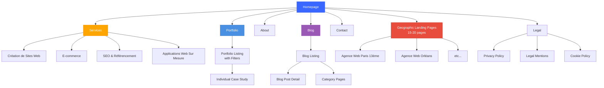
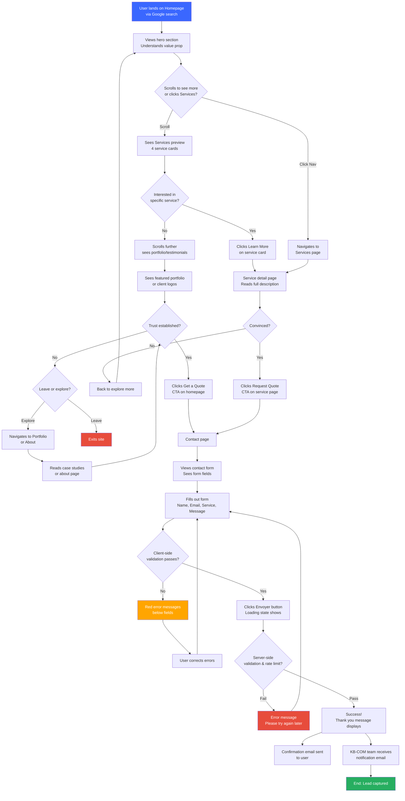
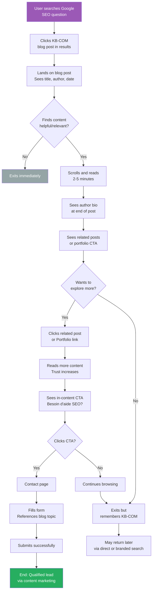
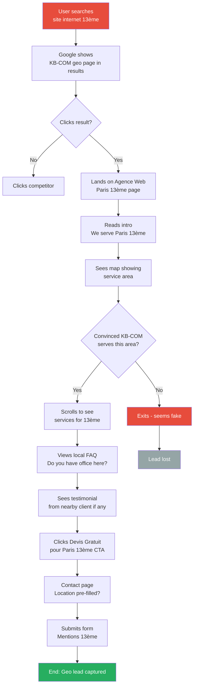

# KB-COM - UI/UX Specification

<!-- Powered by BMAD™ Core -->

**Project:** KB-COM Website Redesign with SEO Excellence
**Version:** 1.0
**Date:** 2026-01-06
**Status:** Draft
**UX Expert:** Sally (BMAD UX Expert Agent)

---

## Introduction

This document defines the user experience goals, information architecture, user flows, and visual design specifications for KB-COM's website redesign. It serves as the foundation for visual design and frontend development, ensuring a cohesive, user-centered experience that achieves the dual objectives of SEO excellence and lead generation.

The design philosophy centers on demonstrating KB-COM's technical expertise through the site itself—every interaction, every page load, every visual detail should communicate professionalism, modernity, and digital mastery. This is not just a marketing site; it's a showcase of what KB-COM can deliver for clients.

### Overall UX Goals & Principles

#### Target User Personas

**Primary Persona: "Laurent - The Local Business Owner"**
- **Demographics:** 35-55 years old, owner/director of PME/TPE in Tours and Indre-et-Loire region
- **Business:** Retail, services, professional services (lawyer, accountant, healthcare), local trades
- **Tech Savvy:** Moderate; comfortable with smartphones and social media, but not a technical expert
- **Goals:**
  - Attract more local customers online
  - Modernize company image
  - Stay competitive with other local businesses
  - Understand what's possible with modern web technology
- **Pain Points:**
  - Current website is outdated or non-existent
  - Doesn't understand SEO or why it matters
  - Has been burned by previous agencies (overpromising, underdelivering)
  - Budget-conscious but willing to invest if ROI is clear
- **Behaviors:**
  - Searches Google for "agence web Tours" from desktop at office
  - Compares 3-5 agencies before deciding
  - Looks for local references and testimonials
  - Wants to meet in person before committing
  - Decision influenced by professionalism and trustworthiness signals
- **Success Criteria:** Laurent finds KB-COM credible, understands their services, and feels confident requesting a quote

**Secondary Persona: "Sophie - The Startup Founder"**
- **Demographics:** 28-40 years old, entrepreneur launching a startup or digital project
- **Business:** SaaS, e-commerce, digital services
- **Tech Savvy:** High; understands modern web technologies, follows tech trends
- **Goals:**
  - Find a technical partner who can build sophisticated web applications
  - Launch quickly with an MVP
  - Scale efficiently as business grows
  - Work with an agency that "gets" startups
- **Pain Points:**
  - Traditional agencies move too slowly
  - Needs modern stack (React, Next.js, cloud-native)
  - Limited budget initially, needs cost-effective solutions
  - Wants transparency and direct communication with developers
- **Behaviors:**
  - Searches for "développeur web sur mesure Tours" or "agence Next.js France"
  - Evaluates agencies based on tech stack and portfolio
  - Reads blog posts about technical topics
  - Values speed and flexibility over formality
- **Success Criteria:** Sophie is impressed by KB-COM's technical expertise, sees relevant portfolio examples, and initiates contact

**Tertiary Persona: "Marie - The Marketing Manager"**
- **Demographics:** 30-45 years old, marketing professional at established company (20-200 employees)
- **Business:** E-commerce, B2B services, regional brands
- **Tech Savvy:** Moderate-high; uses marketing tools daily, understands analytics
- **Goals:**
  - Improve website conversion rates
  - Enhance SEO to reduce paid ad costs
  - Implement tracking and analytics properly
  - Ensure website supports marketing campaigns
- **Pain Points:**
  - Current site is slow and doesn't convert well
  - Can't easily update content herself
  - Needs better integration with marketing tools (CRM, email, analytics)
  - Frustrated with developers who don't understand marketing goals
- **Behaviors:**
  - Searches for "agence SEO Tours" or "refonte site e-commerce"
  - Evaluates agencies on results and metrics (rankings, traffic, conversions)
  - Wants data-driven recommendations
  - Needs regular reporting and transparent communication
- **Success Criteria:** Marie sees KB-COM understands marketing objectives, offers measurement/reporting, and can improve her current situation

#### Usability Goals

1. **Immediate Clarity** (< 3 seconds): Visitors understand what KB-COM does within 3 seconds of landing on homepage
2. **Effortless Navigation** (< 2 clicks): All core information (services, portfolio, contact) accessible within 2 clicks from homepage
3. **Mobile Excellence**: Flawless experience on mobile devices (touch targets ≥ 48px, readable text without zooming, fast loading)
4. **Trust Building** (< 1 minute): Visitors encounter trust signals (client logos, testimonials, results) within first minute of browsing
5. **Conversion Simplicity**: Contact form completable in < 60 seconds with minimal friction
6. **Information Scent**: Clear, descriptive labels and headings guide users to desired information without guessing
7. **Performance Perception**: Page transitions and interactions feel instant (< 100ms perceived delay)
8. **Accessibility**: All users, including those with disabilities, can complete core tasks using assistive technologies

#### Design Principles

1. **Clarity Over Cleverness**
   Every design decision prioritizes clear communication over aesthetic innovation. If a user has to think about what something does, it's failing. Use familiar patterns, straightforward language, and obvious affordances.

2. **Performance is UX**
   Speed is not just a technical metric—it's a core part of the user experience. Every animation, every image, every line of code must justify its performance cost. Target: every interaction feels instant.

3. **Progressive Disclosure**
   Show only what's necessary when it's necessary. Complex information (detailed service offerings, technical capabilities) revealed progressively as users express interest, not dumped on them upfront.

4. **Authenticity Through Specificity**
   Avoid generic "agency speak." Use specific examples, real metrics, actual client stories. The site should feel personal and local, not like a template. Replace "We help businesses succeed" with "We helped Boulangerie Dupont increase online orders by 150% in 3 months."

5. **Design for Real Scenarios**
   Consider edge cases, loading states, empty states, error states. Design for the messy reality of use, not the happy path demo. What happens when images don't load? When forms fail? When there's no portfolio in a category?

### Change Log

| Date       | Version | Description                    | Author          |
|------------|---------|--------------------------------|-----------------|
| 2026-01-06 | 1.0     | Initial UX specification       | BMAD UX Expert  |

---

## Information Architecture (IA)

### Site Map / Screen Inventory



**Total Page Count (MVP):**
- Core pages: 6 (Homepage, Services landing, Portfolio landing, About, Blog landing, Contact)
- Service detail pages: 4
- Portfolio case studies: 5-10
- Blog posts: 10-15
- Geographic landing pages: 15-20
- Legal pages: 3
- **Estimated Total: 45-60 pages**

### Navigation Structure

**Primary Navigation (Desktop Header):**
- **Location:** Sticky header, becomes compact on scroll
- **Items (left to right):**
  1. KB-COM Logo (linked to homepage)
  2. Services (dropdown on hover/click)
     - Création de Sites Web
     - E-commerce
     - SEO & Référencement
     - Applications Web Sur Mesure
  3. Portfolio
  4. À Propos
  5. Blog
  6. Contact (CTA style: filled button with accent color)
- **Right Side:**
  - Phone number (click-to-call on mobile)
  - Optional: Language switcher (if Phase 2 multi-langue)
- **Behavior:**
  - Transparent background on homepage hero (text white)
  - Solid background with shadow on scroll (text dark)
  - Sticky (always visible)
  - Smooth scroll to sections if anchors used

**Mobile Navigation (< 768px):**
- **Hamburger Menu (☰):** Top right, opens full-screen drawer
- **Drawer Contents:**
  - Main navigation items (stacked vertically)
  - Services as accordion (expand to show sub-items)
  - CTA button: "Demander un Devis" (prominent)
  - Contact info: Phone, email, address
  - Social links (LinkedIn, Twitter if applicable)
- **Close:** X button top right, or tap outside drawer (with backdrop)
- **Accessibility:** Focus trap within drawer, Escape key closes

**Footer Navigation:**
- **Column 1: KB-COM**
  - Logo
  - Tagline: "Votre agence web à Tours"
  - Address, phone, email
  - Social media icons
- **Column 2: Services**
  - Links to 4 service pages
- **Column 3: Ressources**
  - Portfolio
  - Blog
  - À Propos
  - Contact
- **Column 4: Légal**
  - Privacy Policy
  - Legal Mentions
  - Cookie Policy
- **Bottom Bar:**
  - Copyright: "© 2026 KB-COM. Tous droits réservés."
  - Link to sitemap.xml
  - "Made with ❤️ in Tours"

**Breadcrumb Strategy:**
- **When to Show:** All pages except homepage
- **Format:** Home > Section > Page (e.g., Home > Portfolio > Refonte Boulangerie Dupont)
- **Schema.org Markup:** BreadcrumbList structured data for SEO
- **Style:** Subtle, above page title, separator: / or >
- **Mobile:** Truncate middle items on small screens (Home > ... > Current Page)

---

## User Flows

### Flow 1: New Visitor → Quote Request (Primary Conversion Path)

**User Goal:** Laurent (local business owner) wants to request a quote for a new website

**Entry Points:**
- Google organic search result (e.g., "agence web Tours")
- Direct URL (heard from referral)
- Google Business Profile

**Success Criteria:** Form submitted successfully, confirmation displayed, KB-COM team receives notification

#### Flow Diagram



#### Edge Cases & Error Handling

- **Form Spam:** Honeypot field (hidden) catches bots, rate limiting prevents abuse (5 submissions/hour/IP)
- **Network Failure During Submit:** Show user-friendly error "Network error. Please check your connection and try again." with retry button
- **Invalid Email Format:** Client-side validation prevents submission, shows "Email invalide" message
- **Required Fields Missing:** Highlight missing fields in red, focus first error, announce error to screen readers
- **Server Down:** Graceful error page with apology, phone number to call instead, email address as fallback
- **Form Already Submitted:** If user tries to submit twice rapidly, debounce and show "Votre demande a déjà été envoyée"

**Notes:**
- Average flow completion time target: 90 seconds from homepage to form submit
- Conversion funnel tracking in GA4: Homepage → Service Page → Contact → Submit
- A/B test CTA button text: "Demander un Devis" vs. "Obtenir un Devis Gratuit" vs. "Parlons de Votre Projet"

---

### Flow 2: Existing Client → Blog Post → Contact (Content Marketing Path)

**User Goal:** Marie (marketing manager) searches for SEO tips, finds KB-COM blog, gains trust, requests help

**Entry Points:**
- Google search for "comment améliorer SEO site web"
- LinkedIn shared blog post
- Newsletter link (future)

**Success Criteria:** Reads blog post, values content, initiates contact

#### Flow Diagram



#### Edge Cases & Error Handling

- **Blog Post 404:** If deleted or URL changed, redirect to blog homepage or similar post
- **Slow Load on Mobile:** Show skeleton placeholder for images/content while loading
- **No Related Posts:** Show fallback CTA to contact or explore services
- **User Blocks JavaScript:** Content still readable (Server-Side Rendered), CTAs still clickable

**Notes:**
- Track scroll depth (25%, 50%, 75%, 100%) to understand engagement
- Social share buttons: LinkedIn, Twitter (with pre-filled text mentioning KB-COM)
- Estimated read time displayed (e.g., "Lecture : 5 min")

---

### Flow 3: Geographic Search → Landing Page → Contact (Low-KD SEO Strategy)

**User Goal:** User in Paris 13ème searches "site internet 13ème", discovers KB-COM, requests quote

**Entry Points:**
- Google organic search for geo-specific query (e.g., "agence web 13ème", "création site Orléans")

**Success Criteria:** User convinced KB-COM serves their area, submits contact form

#### Flow Diagram



#### Edge Cases & Error Handling

- **User Not in Target Area:** FAQ clarifies "Yes, we serve all of Île-de-France remotely, and Tours locally"
- **Duplicate Content Concerns:** Each geo page has unique intro (500+ words), local FAQ, contextual differences
- **No Local Testimonial:** Show general testimonials or omit section gracefully
- **Map Doesn't Load:** Fallback to static image or simple text address

**Notes:**
- Track conversion rate per geo page to identify best-performing locations
- Heatmap analysis: Are users clicking map? Reading FAQ? Bouncing at specific sections?
- A/B test: Show distance from Tours ("45 min from our Tours office") vs. generic "We serve [location]"

---

## Wireframes & Mockups

**Primary Design Files:**
Design files will be created in **Figma** (cloud-based, collaborative, industry-standard).
Link to Figma workspace: *(To be created and shared with development team)*

Figma will contain:
- High-fidelity mockups for all key screens (desktop, tablet, mobile)
- Interactive prototypes for critical flows (homepage → contact, blog post interaction)
- Design system (components, colors, typography, spacing tokens)
- Developer handoff mode with CSS specs, asset exports

### Key Screen Layouts (Wireframe Descriptions)

Below are textual/ASCII wireframe descriptions for key screens. These will be translated into high-fidelity designs in Figma.

---

#### 1. Homepage (Desktop)

```
┌────────────────────────────────────────────────────────────────────┐
│ [HEADER - Sticky]                                                  │
│  KB-COM Logo    [Services ▾] [Portfolio] [À Propos] [Blog]        │
│                                                   [Contact] 📞 Tours│
├────────────────────────────────────────────────────────────────────┤
│                                                                     │
│  ┌───────────────────────────────────────────────────────────────┐ │
│  │                                                                │ │
│  │               HERO SECTION (Full viewport height)             │ │
│  │                                                                │ │
│  │   H1: Votre Agence Web à Tours                                │ │
│  │       Création de Sites Internet Performants & Référencés     │ │
│  │                                                                │ │
│  │   Subheading: Nous transformons vos idées en sites web        │ │
│  │   modernes, rapides et optimisés pour Google.                 │ │
│  │                                                                │ │
│  │   [CTA Button: Demander un Devis Gratuit]                     │ │
│  │   [Secondary CTA: Voir Nos Réalisations ↓]                    │ │
│  │                                                                │ │
│  │   (Background: Modern gradient or hero image of Tours skyline)│ │
│  │                                                                │ │
│  └───────────────────────────────────────────────────────────────┘ │
│                                                                     │
│  ┌───────────────────────────────────────────────────────────────┐ │
│  │ TRUST BAR (Logo strip)                                        │ │
│  │  "Ils nous font confiance"                                    │ │
│  │  [Client Logo 1] [Client Logo 2] [Client Logo 3] [Client Logo 4]│
│  └───────────────────────────────────────────────────────────────┘ │
│                                                                     │
│  ┌───────────────────────────────────────────────────────────────┐ │
│  │ SERVICES SECTION (4-column grid)                              │ │
│  │                                                                │ │
│  │  H2: Nos Services Web                                         │ │
│  │                                                                │ │
│  │  ┌─────────────┐ ┌─────────────┐ ┌─────────────┐ ┌──────────┐│ │
│  │  │ 🖥️ Création │ │ 🛒 E-commerce│ │ 📈 SEO      │ │ ⚙️ Apps  ││ │
│  │  │ de Sites    │ │              │ │ Référencement│ │ Sur Mesure││ │
│  │  │             │ │              │ │              │ │           ││ │
│  │  │ Description │ │ Description  │ │ Description  │ │ Description││
│  │  │ 2-3 lines   │ │ 2-3 lines    │ │ 2-3 lines    │ │ 2-3 lines ││ │
│  │  │             │ │              │ │              │ │           ││ │
│  │  │ [En savoir +]│ │ [En savoir +]│ │ [En savoir +]│ │[En savoir+]││
│  │  └─────────────┘ └─────────────┘ └─────────────┘ └──────────┘│ │
│  └───────────────────────────────────────────────────────────────┘ │
│                                                                     │
│  ┌───────────────────────────────────────────────────────────────┐ │
│  │ WHY KB-COM? (3-column grid)                                   │ │
│  │                                                                │ │
│  │  H2: Pourquoi Choisir KB-COM ?                                │ │
│  │                                                                │ │
│  │  ┌───────────────┐ ┌───────────────┐ ┌──────────────────┐   │ │
│  │  │ ✓ Expertise   │ │ ✓ SEO Garanti │ │ ✓ Accompagnement │   │ │
│  │  │   Technique   │ │                │ │   Local          │   │ │
│  │  │               │ │                │ │                  │   │ │
│  │  │ Next.js, React│ │ Top 3 Google   │ │ Basés à Tours    │   │ │
│  │  │ technologies  │ │ sur vos mots-  │ │ Disponibles pour │   │ │
│  │  │ modernes      │ │ clés cibles    │ │ rendez-vous      │   │ │
│  │  └───────────────┘ └───────────────┘ └──────────────────┘   │ │
│  └───────────────────────────────────────────────────────────────┘ │
│                                                                     │
│  ┌───────────────────────────────────────────────────────────────┐ │
│  │ FEATURED PORTFOLIO (3-column grid of case studies)           │ │
│  │                                                                │ │
│  │  H2: Nos Dernières Réalisations                               │ │
│  │                                                                │ │
│  │  ┌──────────┐  ┌──────────┐  ┌──────────┐                    │ │
│  │  │ [Image]  │  │ [Image]  │  │ [Image]  │                    │ │
│  │  │ Project 1│  │ Project 2│  │ Project 3│                    │ │
│  │  │ Client   │  │ Client   │  │ Client   │                    │ │
│  │  │ +150%    │  │ 100/100  │  │ 3x faster│                    │ │
│  │  │ trafic   │  │ Lighthouse│  │ load time│                    │ │
│  │  │[Voir +]  │  │[Voir +]  │  │[Voir +]  │                    │ │
│  │  └──────────┘  └──────────┘  └──────────┘                    │ │
│  │                                                                │ │
│  │  [Voir Tout le Portfolio →]                                   │ │
│  └───────────────────────────────────────────────────────────────┘ │
│                                                                     │
│  ┌───────────────────────────────────────────────────────────────┐ │
│  │ TESTIMONIALS CAROUSEL                                         │ │
│  │                                                                │ │
│  │  H2: Ce Que Disent Nos Clients                                │ │
│  │                                                                │ │
│  │  ┌────────────────────────────────────────────────────────┐  │ │
│  │  │ "KB-COM a transformé notre présence en ligne. Nous     │  │ │
│  │  │  sommes maintenant en première page Google!"           │  │ │
│  │  │                                                         │  │ │
│  │  │  - Jean Dupont, Boulangerie Dupont                     │  │ │
│  │  │  ⭐⭐⭐⭐⭐                                               │  │ │
│  │  │                                                         │  │ │
│  │  │  [Photo]                                                │  │ │
│  │  └────────────────────────────────────────────────────────┘  │ │
│  │                                                                │ │
│  │  [< Previous] [• • •] [Next >]                                │ │
│  └───────────────────────────────────────────────────────────────┘ │
│                                                                     │
│  ┌───────────────────────────────────────────────────────────────┐ │
│  │ BLOG PREVIEW (Latest 3 posts)                                 │ │
│  │                                                                │ │
│  │  H2: Derniers Articles du Blog                                │ │
│  │                                                                │ │
│  │  ┌─────────┐ ┌─────────┐ ┌─────────┐                         │ │
│  │  │ [Image] │ │ [Image] │ │ [Image] │                         │ │
│  │  │ Title   │ │ Title   │ │ Title   │                         │ │
│  │  │ Excerpt │ │ Excerpt │ │ Excerpt │                         │ │
│  │  │ [Lire →]│ │ [Lire →]│ │ [Lire →]│                         │ │
│  │  └─────────┘ └─────────┘ └─────────┘                         │ │
│  │                                                                │ │
│  │  [Voir Tous les Articles →]                                   │ │
│  └───────────────────────────────────────────────────────────────┘ │
│                                                                     │
│  ┌───────────────────────────────────────────────────────────────┐ │
│  │ FINAL CTA (Full-width, colored background)                   │ │
│  │                                                                │ │
│  │  H2: Prêt à Lancer Votre Projet Web ?                         │ │
│  │  Obtenez un devis gratuit en moins de 24 heures               │ │
│  │                                                                │ │
│  │  [CTA Button: Demander un Devis →]                            │ │
│  │  Ou appelez-nous : 02 XX XX XX XX                             │ │
│  └───────────────────────────────────────────────────────────────┘ │
│                                                                     │
├────────────────────────────────────────────────────────────────────┤
│ [FOOTER]                                                           │
│  ┌────────────┬─────────────┬───────────────┬────────────────────┐│
│  │ KB-COM     │ Services    │ Ressources    │ Légal              ││
│  │ Logo       │  Création   │  Portfolio    │  Privacy           ││
│  │ Tagline    │  E-commerce │  Blog         │  Mentions Légales  ││
│  │ Address    │  SEO        │  À Propos     │  Cookies           ││
│  │ Phone      │  Apps       │  Contact      │                    ││
│  │ Email      │             │               │                    ││
│  │ [LinkedIn] │             │               │                    ││
│  └────────────┴─────────────┴───────────────┴────────────────────┘│
│                                                                     │
│  © 2026 KB-COM. Tous droits réservés. Made with ❤️ in Tours       │
└────────────────────────────────────────────────────────────────────┘
```

**Key Interactions:**
- Smooth scroll when clicking "Voir Nos Réalisations" anchor
- Hover effects on service cards (subtle lift + shadow)
- Testimonial carousel auto-advances every 5 seconds (pause on hover)
- Sticky header shrinks on scroll (logo smaller, padding reduced)

---

#### 2. Contact Page (Desktop & Mobile)

**Desktop Layout:**

```
┌────────────────────────────────────────────────────────────────────┐
│ [HEADER]                                                            │
├────────────────────────────────────────────────────────────────────┤
│                                                                     │
│  [Breadcrumb: Home > Contact]                                      │
│                                                                     │
│  ┌─────────────────────────────────────────────────────────────┐  │
│  │ H1: Contactez-Nous                                          │  │
│  │ Subheading: Obtenez un devis gratuit en moins de 24 heures │  │
│  └─────────────────────────────────────────────────────────────┘  │
│                                                                     │
│  ┌──────────────────────────────┬───────────────────────────────┐ │
│  │ LEFT: CONTACT FORM (60%)     │ RIGHT: CONTACT INFO (40%)     │ │
│  │                              │                               │ │
│  │ H2: Parlez-nous de Votre     │ H3: Coordonnées               │ │
│  │     Projet                   │                               │ │
│  │                              │ 📍 Address:                   │ │
│  │ [Label: Votre Nom *]         │    123 Rue Example            │ │
│  │ [Input: Text field]          │    37000 Tours, France        │ │
│  │                              │                               │ │
│  │ [Label: Votre Email *]       │ 📞 Téléphone:                 │ │
│  │ [Input: Email field]         │    02 XX XX XX XX             │ │
│  │                              │    (Click to call on mobile)  │ │
│  │ [Label: Téléphone (opt.)]    │                               │ │
│  │ [Input: Phone field]         │ ✉️ Email:                     │ │
│  │                              │    contact@kb-com.fr          │ │
│  │ [Label: Service Souhaité *]  │                               │ │
│  │ [Dropdown:                   │ 🕒 Horaires:                  │ │
│  │   - Création de Sites        │    Lun-Ven: 9h-18h            │ │
│  │   - E-commerce               │    Sam-Dim: Fermé             │ │
│  │   - SEO & Référencement      │                               │ │
│  │   - Applications Sur Mesure  │ ──────────────────────────    │ │
│  │   - Autre                   ]│                               │ │
│  │                              │ H3: Localisation              │ │
│  │ [Label: Décrivez Votre       │                               │ │
│  │         Projet *]            │ [Google Maps Embed]           │ │
│  │ [Textarea: 4-5 rows]         │ (Interactive map showing      │ │
│  │                              │  KB-COM office in Tours)      │ │
│  │ [Label: Budget Estimé (opt.)]│                               │ │
│  │ [Dropdown:                   │ ──────────────────────────    │ │
│  │   - Moins de 5 000€          │                               │ │
│  │   - 5 000€ - 10 000€         │ H3: Besoin d'Aide ?           │ │
│  │   - 10 000€ - 25 000€        │                               │ │
│  │   - Plus de 25 000€         ]│ Consultez notre FAQ:          │ │
│  │                              │ • Quels sont vos délais ?     │ │
│  │ [Checkbox: ☐ J'accepte d'être│ • Travaillez-vous à distance ?│ │
│  │  contacté par KB-COM pour    │ • Quels sont vos tarifs ?     │ │
│  │  discuter de mon projet *]   │                               │ │
│  │  [Link: Privacy Policy]      │ [Lire la FAQ complète →]      │ │
│  │                              │                               │ │
│  │ [CTA Button: Envoyer ma      │                               │ │
│  │              Demande →]      │                               │ │
│  │  (Large, prominent, accent   │                               │ │
│  │   color, with loading state) │                               │ │
│  │                              │                               │ │
│  └──────────────────────────────┴───────────────────────────────┘ │
│                                                                     │
│  ┌─────────────────────────────────────────────────────────────┐  │
│  │ WHAT HAPPENS NEXT? (3-step process)                         │  │
│  │                                                              │  │
│  │  1️⃣ Vous envoyez votre demande                              │  │
│  │  2️⃣ Nous vous contactons sous 24h                           │  │
│  │  3️⃣ Nous planifions un rendez-vous gratuit                  │  │
│  └─────────────────────────────────────────────────────────────┘  │
│                                                                     │
├────────────────────────────────────────────────────────────────────┤
│ [FOOTER]                                                            │
└────────────────────────────────────────────────────────────────────┘
```

**Mobile Layout (<768px):**

- Form and contact info stack vertically (form first, then contact info)
- Map becomes smaller (300px height)
- Form fields full width
- Submit button fixed to bottom of viewport (sticky CTA)
- Phone number in header becomes click-to-call button

**Form Validation States:**

```
[VALID INPUT]
┌─────────────────────────────┐
│ Email                       │ ✓ (green checkmark)
│ jean@example.com            │
└─────────────────────────────┘

[INVALID INPUT]
┌─────────────────────────────┐
│ Email                       │ ✗ (red X)
│ invalid-email               │
└─────────────────────────────┘
  ⚠️ Email invalide (red text below)

[LOADING STATE]
┌───────────────────────────────┐
│ [⟳ Envoi en cours...]         │ (button disabled, spinner)
└───────────────────────────────┘

[SUCCESS STATE]
┌──────────────────────────────────────────────┐
│ ✓ Merci ! Votre demande a été envoyée.      │
│   Nous vous répondrons sous 24 heures.      │
│   Un email de confirmation vous a été envoyé.│
└──────────────────────────────────────────────┘
```

---

#### 3. Blog Post Detail Page (Mobile-First)

```
┌────────────────────────────────────┐
│ [MOBILE HEADER - Compact]          │
│ KB-COM Logo          ☰ Menu        │
├────────────────────────────────────┤
│                                    │
│ [Breadcrumb]                       │
│ Home > Blog > SEO > [Title]        │
│                                    │
│ ┌──────────────────────────────┐  │
│ │ [Featured Image]             │  │
│ │ (Full width, 16:9 ratio)     │  │
│ └──────────────────────────────┘  │
│                                    │
│ [Category Badge: SEO & Référence.] │
│                                    │
│ H1: Comment Améliorer Votre        │
│     Référencement Local en 2026    │
│                                    │
│ [Author Photo] Marie Dupont        │
│                6 janvier 2026      │
│                📚 Lecture : 8 min  │
│                                    │
│ [Social Share: LinkedIn Twitter]   │
│                                    │
│ ────────────────────────────────── │
│                                    │
│ [TABLE OF CONTENTS - Collapsible]  │
│ ▼ Dans cet article                 │
│   • Introduction                   │
│   • Optimiser Google Business      │
│   • Citations locales              │
│   • Avis clients                   │
│   • Schema.org LocalBusiness       │
│   • Conclusion                     │
│                                    │
│ ────────────────────────────────── │
│                                    │
│ ARTICLE BODY                       │
│ (Rich text with proper typography) │
│                                    │
│ ## Introduction                    │
│                                    │
│ Lorem ipsum dolor sit amet,        │
│ consectetur adipiscing elit...     │
│ (18px font, 1.7 line height,       │
│  max-width 65ch for readability)   │
│                                    │
│ [Inline Image with Caption]        │
│                                    │
│ ## Optimiser Google Business       │
│                                    │
│ Paragraph text...                  │
│                                    │
│ - Bullet point                     │
│ - Bullet point                     │
│                                    │
│ > Blockquote example               │
│   Important tip highlighted        │
│                                    │
│ [Code block if technical post]     │
│                                    │
│ ## Conclusion                      │
│                                    │
│ Final paragraphs...                │
│                                    │
│ ────────────────────────────────── │
│                                    │
│ [CTA BOX - Highlighted]            │
│ 💡 Besoin d'Aide pour Votre SEO ?  │
│                                    │
│ KB-COM vous accompagne dans votre  │
│ stratégie de référencement local.  │
│                                    │
│ [Button: Demander un Audit SEO →]  │
│                                    │
│ ────────────────────────────────── │
│                                    │
│ AUTHOR BIO                         │
│ ┌─────────┬──────────────────────┐ │
│ │ [Photo] │ À Propos de l'Auteur │ │
│ │         │ Marie Dupont         │ │
│ │         │ Experte SEO chez     │ │
│ │         │ KB-COM. 10 ans       │ │
│ │         │ d'expérience en      │ │
│ │         │ référencement local. │ │
│ │         │ [LinkedIn] [Twitter] │ │
│ └─────────┴──────────────────────┘ │
│                                    │
│ ────────────────────────────────── │
│                                    │
│ RELATED POSTS                      │
│ H3: Articles Similaires            │
│                                    │
│ ┌────────────────────────┐        │
│ │ [Thumbnail]            │        │
│ │ Title of Related Post  │        │
│ │ Excerpt...             │        │
│ │ [Lire →]               │        │
│ └────────────────────────┘        │
│                                    │
│ ┌────────────────────────┐        │
│ │ [Thumbnail]            │        │
│ │ Title of Related Post  │        │
│ │ Excerpt...             │        │
│ │ [Lire →]               │        │
│ └────────────────────────┘        │
│                                    │
│ ┌────────────────────────┐        │
│ │ [Thumbnail]            │        │
│ │ Title of Related Post  │        │
│ │ Excerpt...             │        │
│ │ [Lire →]               │        │
│ └────────────────────────┘        │
│                                    │
│ [Button: Tous les Articles →]     │
│                                    │
├────────────────────────────────────┤
│ [FOOTER]                           │
└────────────────────────────────────┘
```

**Reading Experience Features:**
- Progress bar at top (shows scroll progress 0-100%)
- Floating table of contents (desktop sidebar, mobile collapsible)
- Syntax highlighting for code blocks (if technical content)
- Lazy load images as user scrolls
- Estimated read time based on word count (avg 200 words/min)
- Social share with pre-filled text: "Great article from @KBCOM: [title] [url]"

---

## Design System

### Color Palette

**Primary Brand Colors (Light Mode):**

```
Primary (Accent):
  - Main:        #3a67ff (Blue - modern, tech, trust, important text)
  - Light:       #6b8aff (Hover states, backgrounds)
  - Dark:        #2a4fd9 (Active states, borders)
  - Contrast:    #FFFFFF (Text on primary)

Secondary (Neutral Grays):
  - Gray 900:    #1A1A1A (Headings, body text)
  - Gray 700:    #4A4A4A (Secondary text)
  - Gray 500:    #888888 (Muted text, placeholders)
  - Gray 300:    #D1D1D1 (Borders, dividers)
  - Gray 100:    #F5F5F5 (Backgrounds, cards)
  - Gray 50:     #FAFAFA (Subtle backgrounds)
  - White:       #FFFFFF (Page background, card surfaces)

Semantic Colors:
  - Success:     #27AE60 (Green - form success, positive metrics)
  - Warning:     #F39C12 (Orange - alerts, attention)
  - Error:       #E74C3C (Red - validation errors, critical alerts)
  - Info:        #3a67ff (Blue - informational messages)
```

**Dark Mode Colors:**

```
Primary (Accent):
  - Main:        #3a67ff (Same blue - consistency across themes)
  - Light:       #6b8aff (Hover states)
  - Dark:        #2a4fd9 (Active states)
  - Contrast:    #0A0A0A (Text on primary in dark mode)

Background:
  - Base:        #0A0A0A (Page background)
  - Surface:     #1A1A1A (Cards, elevated elements)
  - Elevated:    #2A2A2A (Modals, dropdowns)

Text:
  - Primary:     #FFFFFF (Headings, body text)
  - Secondary:   #B3B3B3 (Secondary text)
  - Muted:       #808080 (Captions, placeholders)

Borders:
  - Default:     #2A2A2A (Subtle dividers)
  - Elevated:    #3A3A3A (Card borders)
```

**Usage Guidelines:**
- **Primary color #3a67ff** used for important text, CTAs, links, key interactive elements
- **Light mode:** White/Gray backgrounds (#FFFFFF, #FAFAFA, #F5F5F5)
- **Dark mode:** Dark backgrounds (#0A0A0A, #1A1A1A) with same blue accent
- **Contrast ratio:** Ensure WCAG AAA compliance (7:1 for body text)
- **Theme switching:** Respect user's system preference (`prefers-color-scheme`), allow manual toggle

---

### Typography

**Font Stack:**

**Primary Font (Headings & Body):**
```css
font-family: 'Inter', -apple-system, BlinkMacSystemFont, 'Segoe UI',
             'Roboto', 'Oxygen', 'Ubuntu', 'Cantarell',
             'Fira Sans', 'Droid Sans', 'Helvetica Neue', sans-serif;
```
- **Why Inter:** Modern, highly legible at all sizes, excellent for screens, supports French accents perfectly, free and open-source
- **Fallbacks:** System fonts ensure fast loading if Inter fails

**Optional Accent Font (Headings Only - if needed):**
```css
font-family: 'Montserrat', 'Inter', sans-serif;
```
- Use sparingly for H1 on homepage hero if more distinctive brand voice desired
- Default: Use Inter for everything (simplicity)

**Type Scale:**

```
┌──────────────────┬─────────────┬──────────────┬─────────────┐
│ Element          │ Desktop     │ Mobile       │ Weight      │
├──────────────────┼─────────────┼──────────────┼─────────────┤
│ H1 (Page Title)  │ 48px/1.1    │ 36px/1.2     │ 700 (Bold)  │
│ H2 (Section)     │ 36px/1.2    │ 28px/1.3     │ 700 (Bold)  │
│ H3 (Subsection)  │ 28px/1.3    │ 24px/1.4     │ 600 (SemiBold)│
│ H4               │ 24px/1.4    │ 20px/1.4     │ 600 (SemiBold)│
│ H5               │ 20px/1.5    │ 18px/1.5     │ 600 (SemiBold)│
│ Body Large       │ 18px/1.7    │ 16px/1.7     │ 400 (Regular)│
│ Body (Default)   │ 16px/1.7    │ 16px/1.7     │ 400 (Regular)│
│ Body Small       │ 14px/1.6    │ 14px/1.6     │ 400 (Regular)│
│ Caption          │ 12px/1.5    │ 12px/1.5     │ 400 (Regular)│
│ Button/CTA       │ 16px/1.2    │ 16px/1.2     │ 600 (SemiBold)│
│ Nav Links        │ 16px/1.5    │ 16px/1.5     │ 500 (Medium) │
└──────────────────┴─────────────┴──────────────┴─────────────┘
```

**Line Height & Spacing:**
- **Body text:** 1.7 (excellent readability for long-form content)
- **Headings:** Tighter (1.1-1.4) for visual hierarchy
- **Max width for body text:** 65-75 characters (optimal line length ~700px max)
- **Paragraph spacing:** 1em margin-bottom

---

### Spacing & Layout

**Spacing System (based on 8px grid):**

```
┌──────┬──────────┬────────────────────────────┐
│ Size │ Value    │ Usage                      │
├──────┼──────────┼────────────────────────────┤
│ xs   │  4px     │ Icon-text gap, tight spacing│
│ sm   │  8px     │ Input padding, small margins│
│ md   │ 16px     │ Default element spacing    │
│ lg   │ 24px     │ Section padding, card gaps │
│ xl   │ 32px     │ Section margins            │
│ 2xl  │ 48px     │ Large section spacing      │
│ 3xl  │ 64px     │ Hero sections, major breaks│
│ 4xl  │ 96px     │ Homepage section gaps      │
│ 5xl  │ 128px    │ Extra large spacing        │
└──────┴──────────┴────────────────────────────┘
```

**Container Widths:**
```
Max Content Width:  1280px (centered with auto margins)
Wide Content:       1440px (for hero sections, images)
Narrow Content:      800px (blog posts, legal text)
```

**Responsive Breakpoints (Tailwind defaults):**
```
sm:  640px   (Mobile landscape)
md:  768px   (Tablet portrait)
lg:  1024px  (Tablet landscape, small desktop)
xl:  1280px  (Desktop)
2xl: 1536px  (Large desktop)
```

**Grid System:**
- **Desktop:** 12-column grid
- **Tablet:** 8-column grid
- **Mobile:** 4-column grid
- **Gutter:** 24px (lg spacing)

---

### Component Specifications

#### Buttons

**Primary Button (CTA):**
```
Background:   #3a67ff (Primary)
Text:         #FFFFFF (White)
Padding:      12px 32px (md:lg)
Border Radius: 12px (modern, rounded)
Font:         16px, 600 weight
Shadow:       0 2px 4px rgba(58,103,255,0.15),
              0 8px 16px rgba(58,103,255,0.1)

Hover:
  Background: #2a4fd9 (Primary Dark)
  Shadow:     0 4px 8px rgba(58,103,255,0.25),
              0 16px 32px rgba(58,103,255,0.15)
  Transform:  translateY(-2px)
  Transition: all 0.3s cubic-bezier(0.44, 0, 0.56, 1)

Active:
  Background: #2a4fd9
  Transform:  translateY(0)
  Shadow:     0 1px 2px rgba(0,0,0,0.1)

Focus:
  Outline:    3px solid #6b8aff (Primary Light, 50% opacity)
  Offset:     2px

Disabled:
  Background: #D1D1D1 (Gray 300)
  Text:       #888888 (Gray 500)
  Cursor:     not-allowed
  Opacity:    0.6
```

**Secondary Button (Ghost/Outline):**
```
Background:   Transparent
Text:         #3a67ff (Primary)
Border:       2px solid #3a67ff
Padding:      10px 30px (accounting for border)
Border Radius: 6px

Hover:
  Background: rgba(0,199,183,0.1)
  Border:     2px solid #2a4fd9
```

**Icon Buttons:**
```
Size:         44px x 44px (touch-friendly)
Icon Size:    20px
Background:   Transparent
Hover:        Background #F5F5F5 (Gray 100)
Border Radius: 50% (circular) or 6px (rounded square)
```

#### Form Inputs

**Text Input / Textarea:**
```
Border:       1px solid #D1D1D1 (Gray 300)
Border Radius: 6px
Padding:      12px 16px
Font:         16px (prevents iOS zoom on focus)
Background:   #FFFFFF

Focus:
  Border:     2px solid #3a67ff (Primary)
  Outline:    none
  Shadow:     0 0 0 3px rgba(0,199,183,0.1)

Error:
  Border:     2px solid #E74C3C (Error)
  Shadow:     0 0 0 3px rgba(231,76,60,0.1)

Disabled:
  Background: #F5F5F5 (Gray 100)
  Text:       #888888 (Gray 500)
  Cursor:     not-allowed
```

**Dropdown / Select:**
```
Same as text input, plus:
Icon:         Chevron down (▾) on right side
Padding Right: 40px (space for icon)
```

**Checkbox / Radio:**
```
Size:         20px x 20px
Border:       2px solid #D1D1D1
Border Radius: 3px (checkbox) / 50% (radio)

Checked:
  Background: #3a67ff (Primary)
  Border:     #3a67ff
  Icon:       White checkmark or dot

Focus:
  Outline:    3px solid #6b8aff (Primary Light, 50% opacity)
```

#### Cards

**Standard Card (Portfolio, Blog):**
```
Background:   #FFFFFF (Light mode) / #1A1A1A (Dark mode)
Border:       1px solid rgba(0,0,0,0.08) (Light) / rgba(255,255,255,0.08) (Dark)
Border Radius: 16px (modern, rounded like reference site)
Padding:      24px
Shadow:       0 2px 4px rgba(0,0,0,0.06),
              0 8px 16px rgba(0,0,0,0.04),
              0 16px 24px rgba(0,0,0,0.02)

Hover:
  Shadow:     0 4px 8px rgba(0,0,0,0.08),
              0 16px 32px rgba(0,0,0,0.06),
              0 32px 48px rgba(0,0,0,0.04)
  Transform:  translateY(-4px)
  Transition: all 0.3s cubic-bezier(0.44, 0, 0.56, 1)
```

**Glassmorphism Card (Hero sections, featured content):**
```
Background:   rgba(255,255,255,0.7) (Light) / rgba(26,26,26,0.7) (Dark)
Backdrop Filter: blur(12px)
Border:       1px solid rgba(255,255,255,0.3) (Light) / rgba(255,255,255,0.1) (Dark)
Border Radius: 16px
Padding:      32px
Shadow:       0 8px 32px rgba(0,0,0,0.12)

Note: Use sparingly for special sections to maintain performance
```

**Image Aspect Ratios:**
```
Portfolio Thumbnails:  16:9
Blog Featured Images:  16:9 or 3:2
Team Photos:           1:1 (square)
Client Logos:          Variable, constrained by height (60px max)
```

#### Navigation

**Desktop Header:**
```
Height:       80px (initial), 64px (scrolled compact)
Background:   Transparent (homepage hero) → #FFFFFF (scrolled)
Shadow:       none (top) → 0 2px 8px rgba(0,0,0,0.08) (scrolled)
Position:     Sticky top
Transition:   all 300ms ease

Logo:
  Height:     48px (initial), 40px (compact)

Nav Links:
  Font:       16px, 500 weight
  Color:      #1A1A1A (scrolled) / #FFFFFF (hero)
  Padding:    8px 16px
  Hover:      Underline 2px #3a67ff
```

**Mobile Menu (Drawer):**
```
Width:        100vw
Background:   #FFFFFF
Slide-in:     From right
Duration:     300ms ease-out
Backdrop:     rgba(0,0,0,0.5) blur(4px)
Z-index:      1000
```

---

### Iconography

**Icon Library:** [Lucide React](https://lucide.dev/)
**Icon Sizes:**
```
Small:   16px (inline text icons)
Medium:  20px (buttons, nav)
Large:   24px (section headings, feature icons)
XLarge:  32px (hero, service cards)
```

**Common Icons:**
- **Menu:** AlignJustify (hamburger)
- **Close:** X
- **Arrow Right:** ArrowRight (CTAs, links)
- **Check:** Check (success, checkboxes)
- **Alert:** AlertCircle (warnings)
- **Email:** Mail
- **Phone:** Phone
- **Location:** MapPin
- **Search:** Search
- **External Link:** ExternalLink

**Icon Style:**
- Stroke width: 2px
- Color: Inherit from parent or Gray 700
- Hover: Primary color (#3a67ff)

---

### Imagery Guidelines

**Photography Style:**
- **Tone:** Professional but approachable, warm
- **Subjects:** Real people (team photos), real office (if applicable), actual client work (screenshots)
- **Avoid:** Generic stock photos of people pointing at screens, overly staged corporate shots
- **Preferred:** Authentic, candid moments; Tours landmarks if local angle emphasized

**Image Optimization:**
- **Format:** WebP primary, AVIF where supported, JPG fallback
- **Compression:** 80-85% quality (balance quality/size)
- **Lazy Loading:** All images below fold
- **Blur-up:** Low-quality placeholder while loading
- **Alt Text:** Descriptive for accessibility and SEO (not "image123.jpg", but "Refonte site web boulangerie Dupont - screenshot homepage")

**Illustrations:**
- **Use Case:** Abstract concepts (SEO, performance), empty states, 404 page
- **Style:** Flat, geometric, minimal (match brand simplicity)
- **Colors:** Primary palette (teal accent, gray tones)
- **Source:** undraw.co or custom SVG illustrations

---

### Animations & Micro-Interactions

**Animation Principles:**
1. **Purposeful:** Every animation should communicate state change or guide attention
2. **Subtle:** Prefer understated over flashy (we're a professional agency, not a circus)
3. **Fast:** Duration 150-300ms for UI interactions, max 500ms for page transitions
4. **Respectful:** Honor `prefers-reduced-motion` media query (disable animations if user prefers)

**Common Animations:**

**Button Hover:**
```css
transition: all 150ms ease;
transform: translateY(-2px);
box-shadow: 0 4px 8px rgba(0,0,0,0.15);
```

**Card Hover:**
```css
transition: all 200ms ease;
transform: translateY(-4px);
box-shadow: 0 8px 16px rgba(0,0,0,0.12);
```

**Page Transitions (Next.js):**
```
Fade in: opacity 0 → 1, duration 300ms
No jarring slides or zooms
```

**Scroll Animations (Framer Motion):**
```javascript
// Fade in on scroll
initial={{ opacity: 0, y: 20 }}
whileInView={{ opacity: 1, y: 0 }}
transition={{ duration: 0.5 }}
viewport={{ once: true }}
```

**Loading States:**
```
Skeleton loaders: Shimmer effect (gray → light gray wave)
Spinners: Simple circular spinner (Primary color)
Progress bars: Smooth 0-100%, Primary color fill
```

**Micro-Interactions:**
```
Form focus:      Input border animates to Primary color (150ms)
Success:         Green checkmark fade-in + scale (200ms)
Error shake:     Input wiggles left-right 3px, 2 iterations (300ms total)
CTA pulse:       Subtle scale 1.0 → 1.05 every 3 seconds (draws attention without annoying)
```

**Reduced Motion:**
```css
@media (prefers-reduced-motion: reduce) {
  * {
    animation-duration: 0.01ms !important;
    animation-iteration-count: 1 !important;
    transition-duration: 0.01ms !important;
  }
}
```

---

## Accessibility (a11y) Requirements

**Target Compliance:** WCAG 2.1 Level AA

### Color Contrast

All text must meet minimum contrast ratios:
- **Normal text (< 18px):** 4.5:1
- **Large text (≥ 18px or 14px bold):** 3.0:1
- **UI components and graphics:** 3.0:1

**Verification:**
- Test all color combinations with [WebAIM Contrast Checker](https://webaim.org/resources/contrastchecker/)
- Gray 900 (#1A1A1A) on White (#FFFFFF): 15.8:1 ✓
- Primary (#3a67ff) on White: 3.1:1 ✓ (large text only)
- White on Primary: 6.8:1 ✓ (all text sizes)

### Keyboard Navigation

**All interactive elements must be keyboard-accessible:**
- Tab order follows logical flow (top-to-bottom, left-to-right)
- Focus indicators clearly visible (3px outline, Primary Light color)
- Skip to main content link (hidden until focused, allows bypassing nav)
- Dropdown menus operable with arrow keys
- Modals/drawers trap focus (can't tab outside), Escape key closes
- No keyboard traps (always a way to navigate away)

**Test:** Navigate entire site using only Tab, Shift+Tab, Enter, Space, Arrow keys, Escape

### Screen Reader Support

**Semantic HTML:**
- Use proper heading hierarchy (H1 → H2 → H3, no skipping levels)
- Landmark regions: `<header>`, `<nav>`, `<main>`, `<footer>`, `<aside>`
- Lists for navigation menus (`<ul>`, `<li>`)
- `<article>` for blog posts and case studies
- `<figure>` and `<figcaption>` for images with captions

**ARIA Labels:**
```html
<!-- Hamburger menu -->
<button aria-label="Ouvrir le menu de navigation" aria-expanded="false">
  <MenuIcon />
</button>

<!-- Search -->
<input type="search" aria-label="Rechercher dans le site" />

<!-- Icon-only buttons -->
<button aria-label="Fermer" aria-describedby="close-help">
  <XIcon />
</button>
<span id="close-help" hidden>Ferme le dialogue</span>

<!-- Form errors -->
<input aria-invalid="true" aria-describedby="email-error" />
<span id="email-error" role="alert">Email invalide</span>

<!-- Loading states -->
<div role="status" aria-live="polite">
  <span>Chargement en cours...</span>
</div>
```

**Alt Text Best Practices:**
- Descriptive alt text for informational images
- Empty alt (`alt=""`) for decorative images (screen readers skip)
- Don't use "image of" or "picture of" (redundant)
- Good: `alt="Refonte du site Boulangerie Dupont - page d'accueil affichant les produits"`
- Bad: `alt="image1.jpg"` or `alt=""`

### Forms Accessibility

**Every form field must have:**
- Associated `<label>` (via `for` attribute or wrapping)
- Clear error messages linked with `aria-describedby`
- Required fields indicated with `required` attribute + visual asterisk
- Fieldsets and legends for grouped inputs (radio buttons, checkboxes)

```html
<label for="name">Votre Nom *</label>
<input
  id="name"
  name="name"
  type="text"
  required
  aria-required="true"
  aria-invalid="false"
  aria-describedby="name-error"
/>
<span id="name-error" role="alert" hidden>
  Le nom doit contenir au moins 2 caractères
</span>
```

### Testing Checklist

**Automated Tools:**
- [ ] Lighthouse accessibility audit (score 100)
- [ ] axe DevTools browser extension (0 violations)
- [ ] WAVE accessibility evaluation tool

**Manual Testing:**
- [ ] Keyboard navigation (Tab through entire site)
- [ ] Screen reader (NVDA on Windows, VoiceOver on macOS/iOS)
- [ ] Zoom to 200% (no horizontal scroll, content still readable)
- [ ] Color blindness simulator (ensure info not conveyed by color alone)

---

## Responsive Design Strategy

### Mobile-First Approach

Design and develop for smallest screen first (320px width), progressively enhance for larger screens.

**Why Mobile-First:**
1. Forces prioritization of essential content
2. Majority of traffic is mobile (60%+)
3. Easier to scale up than down
4. Improves performance (load less on mobile)

### Breakpoint-Specific Considerations

**Mobile (< 768px):**
- Single column layout
- Stacked navigation (hamburger menu)
- Touch targets minimum 48px × 48px
- Larger font sizes for readability (16px minimum body text)
- Click-to-call phone numbers
- Sticky CTAs at bottom of viewport
- Simplified forms (fewer fields visible at once, multi-step if complex)
- Images: smaller file sizes, portrait orientation often better

**Tablet (768px - 1024px):**
- 2-column layouts where appropriate (services grid, portfolio)
- Hybrid navigation (visible nav links + hamburger for sub-menus)
- Larger touch targets still (44px)
- Sidebar content becomes visible (blog TOC)

**Desktop (1024px+):**
- Multi-column layouts (3-4 columns for grids)
- Full horizontal navigation
- Hover states meaningful (on mobile, hover doesn't exist)
- Larger imagery, more visual real estate for hero sections
- Side-by-side form and info (contact page)

### Touch-Friendly Design

**Touch Target Sizes:**
- Minimum: 48px × 48px (Apple HIG, Material Design guidelines)
- Preferred: 44-48px for buttons
- Spacing: 8px minimum between touch targets

**Gestures:**
- Swipe for carousels (testimonials, portfolio)
- Tap to expand (accordions, mobile menu)
- Pinch to zoom disabled on UI (allow on images in lightbox)

**Avoid:**
- Hover-only interactions on mobile (no hover state exists)
- Tiny checkboxes or radio buttons (upscale to 20px+)
- Long horizontal scrolling (except intentional carousels)

---

## Performance Budget

To ensure optimal user experience and SEO rankings, the following performance budgets must be met:

### Core Web Vitals (Google Ranking Factors)

**Largest Contentful Paint (LCP):**
- **Target:** < 1.2 seconds
- **Maximum Acceptable:** < 2.5 seconds
- **How:** Optimize hero images (WebP, lazy load, priority hints), use SSR/SSG, minimize render-blocking resources

**First Input Delay (FID) / Interaction to Next Paint (INP):**
- **Target:** < 100 milliseconds
- **Maximum Acceptable:** < 300 milliseconds
- **How:** Minimize JavaScript execution, code splitting, avoid long tasks

**Cumulative Layout Shift (CLS):**
- **Target:** < 0.1
- **Maximum Acceptable:** < 0.25
- **How:** Set width/height on images, avoid injecting content above fold, use `font-display: swap` carefully

### Additional Metrics

**Time to First Byte (TTFB):**
- **Target:** < 200ms (via edge CDN)

**First Contentful Paint (FCP):**
- **Target:** < 1.0s

**Total Page Weight:**
- **Homepage:** < 1.5MB (including images)
- **Service Pages:** < 1MB
- **Blog Posts:** < 800KB

**JavaScript Bundle Size:**
- **Initial Route:** < 150KB gzipped
- **Total JS (all chunks):** < 300KB gzipped

**Number of Requests:**
- **Target:** < 50 requests per page
- **How:** Bundle assets, use HTTP/2, inline critical CSS

### Testing & Monitoring

**Tools:**
- Lighthouse CI (automated on each PR)
- WebPageTest (real-world testing on 4G connection)
- Chrome DevTools Performance tab
- Vercel Analytics (production Core Web Vitals)

**Acceptance Criteria:**
- Lighthouse Performance score ≥ 95
- Lighthouse SEO score = 100
- Lighthouse Accessibility score ≥ 95
- All Core Web Vitals in "Good" range (green)

---

## Browser & Device Support

### Supported Browsers (Latest 2 Versions)

**Desktop:**
- ✅ Chrome 90+
- ✅ Firefox 88+
- ✅ Safari 14+
- ✅ Edge 90+

**Mobile:**
- ✅ iOS Safari 14+
- ✅ Chrome Mobile (Android) 90+
- ✅ Samsung Internet 14+

**Graceful Degradation:**
- Older browsers (IE11, old Safari) receive functional but unstyled version
- Use `@supports` CSS queries for progressive enhancement
- JavaScript features transpiled with Babel for older environments

### Device Testing

**Minimum Testing Matrix:**

| Device Type | Viewport | Browser | Network |
|-------------|----------|---------|---------|
| iPhone SE   | 375×667  | Safari  | 4G      |
| iPhone 13   | 390×844  | Safari  | 5G      |
| iPad Air    | 820×1180 | Safari  | WiFi    |
| Samsung Galaxy S21 | 360×800 | Chrome | 4G |
| Desktop     | 1920×1080| Chrome  | Broadband |

**Testing Tools:**
- BrowserStack (cross-browser, cross-device testing)
- Chrome DevTools Device Emulation
- Real devices (KB-COM office testing lab)

---

## Design Handoff & Developer Collaboration

### Figma to Code Workflow

**Figma Organization:**
1. **Pages:**
   - 🎨 Design System (colors, typography, components)
   - 📱 Mobile Screens
   - 💻 Desktop Screens
   - 🔄 Prototypes (interactive flows)
   - 📐 Wireframes (low-fidelity)

2. **Frames:**
   - Named clearly (e.g., "Homepage - Desktop 1920", "Contact - Mobile 375")
   - Organized by page type, then device
   - Annotated with notes for developers

3. **Components:**
   - All reusable elements as Figma components
   - Variants for states (default, hover, active, disabled)
   - Auto-layout for responsive behavior
   - Linked to Tailwind classes in descriptions

**Developer Handoff:**
- **Inspect Mode:** Developers use Figma Inspect to get CSS values
- **Asset Export:** Images exported as SVG (icons, logos) or WebP (photos)
- **Spacing:** All spacing follows 8px grid (documented)
- **Colors:** Hex codes match Tailwind config exactly
- **Fonts:** Weights and sizes match type scale

**Documentation:**
- This UX Spec document serves as source of truth
- Figma files are visual reference and detail layer
- Developers ask UX Expert (or designer) for clarification, not make assumptions

---

## Future Enhancements (Post-MVP)

**Phase 2 UX Improvements:**

1. **Advanced Search & Filtering:**
   - Live search with autocomplete
   - Faceted filtering on portfolio (by industry, tech, budget range)
   - Search results page with filters

2. **Personalization:**
   - Geo-detection to show relevant geo landing page CTA ("Based in Paris? See our Paris 13ème services")
   - Returning visitor recognition (show different CTA, "Welcome back!")

3. **Interactive Elements:**
   - Cost calculator (user inputs project requirements, gets estimated budget)
   - Interactive portfolio (filterable by technology, hover for quick preview)
   - Live chat widget (Intercom or Crisp)

4. **Multi-Language:**
   - English version (for international clients)
   - Language toggle in header

5. **Accessibility Enhancements:**
   - Contrast mode toggle (high contrast theme)
   - Font size adjuster
   - Dyslexia-friendly font option

6. **Dark Mode (Low Priority):**
   - System preference detection
   - Manual toggle
   - Alternate color palette

---

## Appendix: UX Research & Testing Plan

### Pre-Launch Testing

**Usability Testing (5-8 Participants):**
- **Profile:** 3 Local Business Owners (Laurent persona), 2 Startup Founders (Sophie), 1-2 Marketing Managers (Marie)
- **Method:** Moderated remote sessions (Zoom), task-based
- **Tasks:**
  1. Find information about e-commerce services
  2. Request a quote for a new website
  3. Read a blog post and navigate to related content
  4. Find a portfolio example similar to your business
- **Metrics:** Task completion rate, time on task, errors, satisfaction (SUS score)
- **Deliverable:** Usability report with findings and recommendations

**A/B Test Plan (Post-Launch):**
- Homepage Hero CTA text ("Demander un Devis" vs. "Parlez-nous de Votre Projet")
- Contact form length (single-page vs. multi-step)
- Portfolio card layout (image-first vs. text-first)
- Blog post CTA placement (mid-article vs. end only)

### Post-Launch Metrics

**Quantitative (GA4):**
- Bounce rate (target < 40%)
- Pages per session (target > 3)
- Average session duration (target > 2 minutes)
- Conversion rate (target 3-5%)
- Mobile vs. desktop engagement (compare bounce, time)

**Qualitative (Hotjar/Clarity):**
- Session recordings (watch 20-30 sessions monthly)
- Heatmaps (click, scroll, move) for homepage, services, contact
- Identify friction points (rage clicks, dead clicks, excessive scrolling)

**User Feedback:**
- Post-contact form survey (1 question: "How did you find our site?" with NPS follow-up)
- Optional feedback widget (Usersnap or similar)

---

## Conclusion & Next Steps

This UX specification provides a comprehensive blueprint for KB-COM's website redesign, balancing business objectives (lead generation, SEO dominance) with user needs (clarity, trust, ease of use). The design prioritizes:

1. **Performance** - Every design decision respects the performance budget
2. **Accessibility** - WCAG AA compliance ensures all users can engage
3. **Conversion** - Clear CTAs and friction-free contact forms drive leads
4. **Authenticity** - Specific, local, real content builds trust

**Immediate Next Steps:**

1. **Stakeholder Review:** KB-COM team reviews and approves this spec (feedback incorporated)
2. **Figma Design:** UX Expert (or designer) creates high-fidelity mockups in Figma based on this spec
3. **Design Review:** Team reviews mockups, approves visual direction
4. **Developer Handoff:** Figma files + this spec shared with development team
5. **Begin Development:** Developers implement designs following Architecture document

**Prepared with BMAD™ Method**
*Ready for Visual Design and Development*

---

**Document Status:** ✅ Complete, Ready for Design Phase
**Next Agent:** Visual Designer (Figma creation) or Developer (if designs approved)
